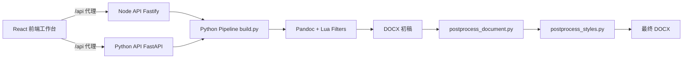

# wordEditor 项目细节落地稿（博客可直接改写）

## 1. 这是什么项目

wordEditor 是一个面向湖南工商大学论文场景的 Markdown -> Word 导出工具。它的目标不是“能导出就行”，而是“导出后尽量直接可交付”：

- 支持学校模板约束（标题层级、编号、正文样式、图表与参考文献样式）
- 通过样式 DSL 做模板化维护，而不是把规则散落在脚本里
- 无需安装 Microsoft Word，即可完成核心后处理

项目入口文档：

- [README.md](../README.md)
- [docs/project-structure.md](./project-structure.md)

## 2. 我解决了什么问题

传统论文排版有三个痛点：

1. 手工改 Word 样式，重复劳动重
2. 模板细则每年微调，人工同步容易漏
3. Markdown 写作和 Word 交付之间存在格式鸿沟

wordEditor 的思路是把“格式治理”前移成一条可重复执行的流水线：

- 写作阶段：专注 Markdown 内容
- 构建阶段：Pandoc + Lua 做语义到结构映射
- 收尾阶段：OOXML 精细注入，修正 Word 最终观感与规范

## 3. 总体架构（前端 + 双后端 + Python 管线）



关键实现入口：

- 前端开发代理与本地编排：[apps/wordEditor-frontend/server/dev-api.ts](../apps/wordEditor-frontend/server/dev-api.ts)
- Python API 入口：[services/api-python/app.py](../services/api-python/app.py)
- Python CLI 统一入口：[services/api-python/run.py](../services/api-python/run.py)
- Node API 启动入口：[services/api-node/src/main.ts](../services/api-node/src/main.ts)
- 核心构建脚本：[services/api-python/pipeline/build.py](../services/api-python/pipeline/build.py)

## 4. 目录分层（写博客时建议按这一段解释）

- 前端应用层：[apps/wordEditor-frontend](../apps/wordEditor-frontend)
  - React + Vite + Ant Design
  - 页面侧负责导出、模板编辑、文档查看
- 服务层：[services](../services)
  - [services/api-node](../services/api-node): Fastify API（Node 生态）
  - [services/api-python](../services/api-python): FastAPI + CLI 收口
  - [services/api-python/pipeline](../services/api-python/pipeline): 真正的导出与后处理能力
- 模板层：[templates](../templates)
  - shared 层放通用 DSL 和 Lua
  - 各模板目录放差异化 styles.yaml
- 配置层：[config/templates.json](../config/templates.json)
  - 注册模板元数据、reference 路径、Lua 过滤器、styles.yaml
- 规范文档层：[docs](.)

## 5. 导出链路细节（核心卖点）

### Step 1: 模板解析

由 [services/api-python/pipeline/build.py](../services/api-python/pipeline/build.py) 读取 [config/templates.json](../config/templates.json)，确定：

- 使用哪套 reference.docx
- 走哪些 Lua 过滤器
- 采用哪套 heading_numbering 规则
- 是否启用三线表后处理

### Step 2: Pandoc 转换

支持两种模式：

- 默认 HTML 管道（兼容性更强）
- no-html-pipe 直转（更快，能力略弱）

### Step 3: 文档结构后处理

[services/api-python/pipeline/postprocess_document.py](../services/api-python/pipeline/postprocess_document.py) 负责：

- 标题识别与层级规范化
- 交叉引用处理
- 章节结构一致性收敛

### Step 4: 样式注入后处理

[services/api-python/pipeline/postprocess_styles.py](../services/api-python/pipeline/postprocess_styles.py) 读取 styles.yaml，将段落、字体、行距、缩进等最终注入 DOCX 的 OOXML。

规则说明见：

- [docs/styles-dsl.md](./styles-dsl.md)

### Step 5: 可选增强

- 三线表处理：ooxml_three_line_table.py
- 文档元数据：apply_docx_metadata.py
- 修改密码：apply_password.py

## 6. 模板系统设计（为什么可维护）

模板不是写死在代码中，而是“配置 + 规则库”协同：

1. 模板注册： [config/templates.json](../config/templates.json)
2. 共享样式基线： [templates/_shared/hutb-base.yaml](../templates/_shared/hutb-base.yaml)
3. 列表样式库： [templates/_shared/list-style-library.yaml](../templates/_shared/list-style-library.yaml)
4. 模板差异覆盖：
   - [templates/hutb-guanke/styles.yaml](../templates/hutb-guanke/styles.yaml)
   - [templates/hutb-gongke/styles.yaml](../templates/hutb-gongke/styles.yaml)
   - [templates/hutb-math-modeling/styles.yaml](../templates/hutb-math-modeling/styles.yaml)

这种拆法的好处：

- 变更一个模板时，不会误伤其它模板
- 学校规则变更可以优先改配置和 YAML，而不是重写整条管线

## 7. 前端工作台价值（不仅是按钮页面）

前端并非“壳层”，而是对复杂管线的可视化控制面板：

- 路由与功能装配：[apps/wordEditor-frontend/src/app/routes.tsx](../apps/wordEditor-frontend/src/app/routes.tsx)
- 本地开发脚本（Python/Node 双后端切换）：[apps/wordEditor-frontend/package.json](../apps/wordEditor-frontend/package.json)
- 通过 /api 统一代理后端，减少前端环境切换成本

技术栈：React 18 + Vite + TypeScript + Ant Design + Monaco Editor + Zustand。

## 8. 快速上手（博客里可直接贴）

### 环境依赖

- Pandoc
- Python 3
- Node.js 18+
- pnpm 8+

Python 依赖见 [requirements.txt](../requirements.txt)。

### 一键导出（CLI）

```powershell
py services/api-python/run.py build -i input/碳中和风光储优化.md -t hutb-guanke
```

### 前后端联调

1. 终端 A（Node API）

```powershell
cd services/api-node
pnpm install
pnpm dev
```

2. 终端 B（Frontend）

```powershell
cd apps/wordEditor-frontend
pnpm install
pnpm dev
```

3. 可选：改为 Python API

```powershell
cd apps/wordEditor-frontend
pnpm dev:python
```

## 9. 典型接口与能力映射

以开发态 /api 为例：

- POST /build/stream: 流式构建（SSE）
- POST /preview/styles: 样式预览
- GET /build/download: 产物下载
- GET /templates: 模板清单
- GET/PUT /file: 读写仓库文本
- GET /docs: 获取规范文档

接口来源说明可参考：

- [apps/wordEditor-frontend/README.md](../apps/wordEditor-frontend/README.md)
- [services/api-python/app.py](../services/api-python/app.py)

## 10. 工程化亮点（博客可重点强调）

1. 双后端兼容
   前端通过同一 /api 入口，切 Node 或 Python 后端不改页面逻辑。

2. 输出可解释
   从模板配置到后处理阶段，每一步有明确脚本入口，定位问题成本低。

3. 不依赖 Word 客户端
   利用 Pandoc + OOXML 处理完成高保真排版，适合 CI 或服务器环境。

4. 模板与规则解耦
   模板变更尽量收敛在 YAML 和配置层，长期维护更稳。

## 11. 已知风险与优化方向

1. Pandoc 与本机环境差异可能导致格式边缘行为不同
2. 复杂公式与极端表格场景仍需持续补充回归样例
3. docs 中少量历史文档存在编码遗留，建议逐步统一为 UTF-8

建议下一步：

- 增加基于示例论文的快照回归（输出结构 diff）
- 为模板规则建立版本号与迁移说明
- 在前端加入“模板差异可视化”视图

## 12. 一句话总结（可做博客结尾）

wordEditor 把“论文排版经验”固化成了可复用的工程流水线：写作在 Markdown，交付在 Word，规范靠模板与后处理自动兜底。
