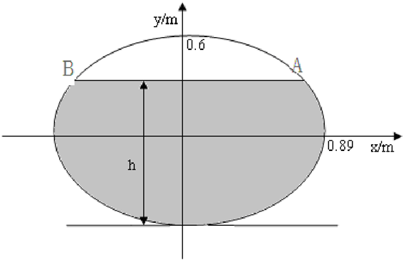
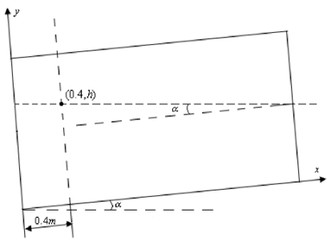
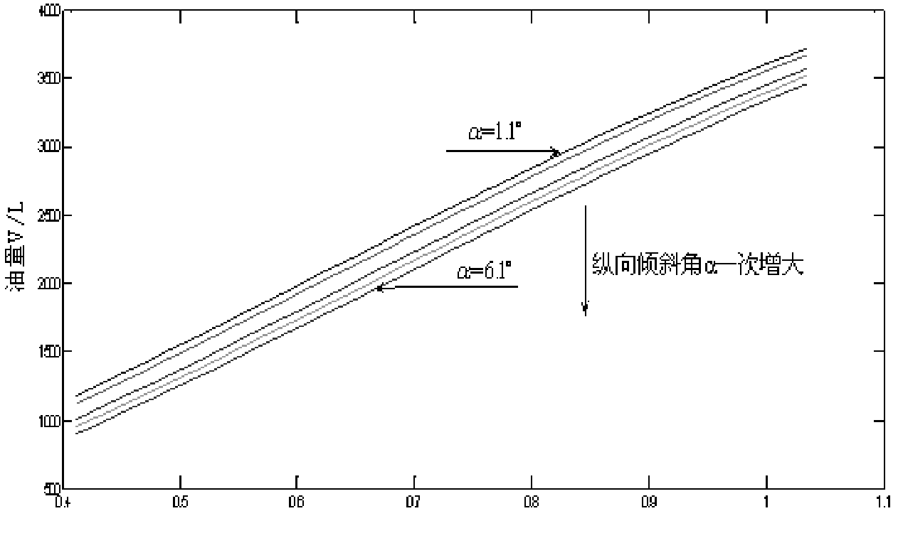
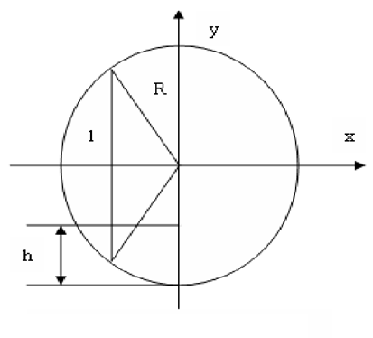
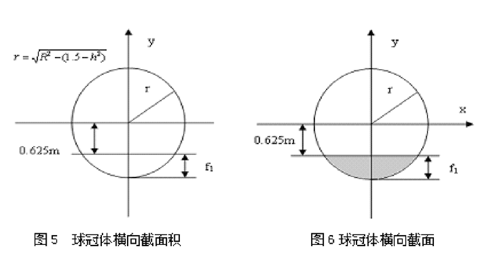
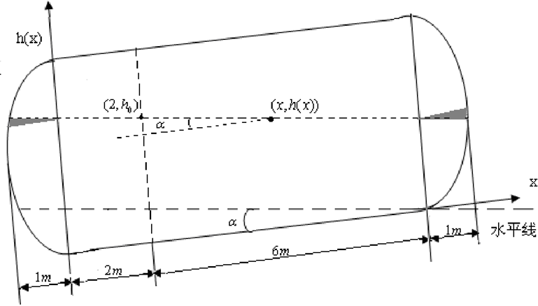
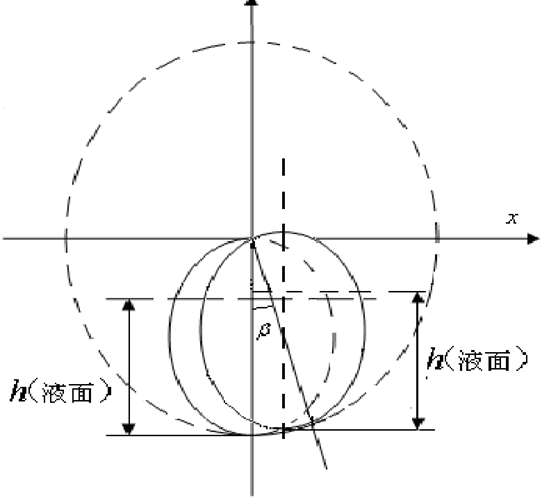
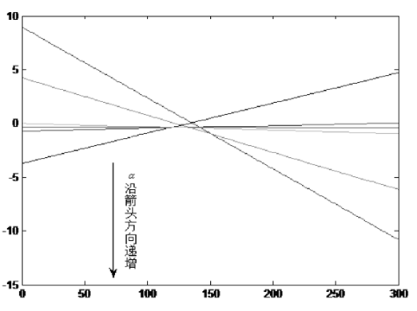
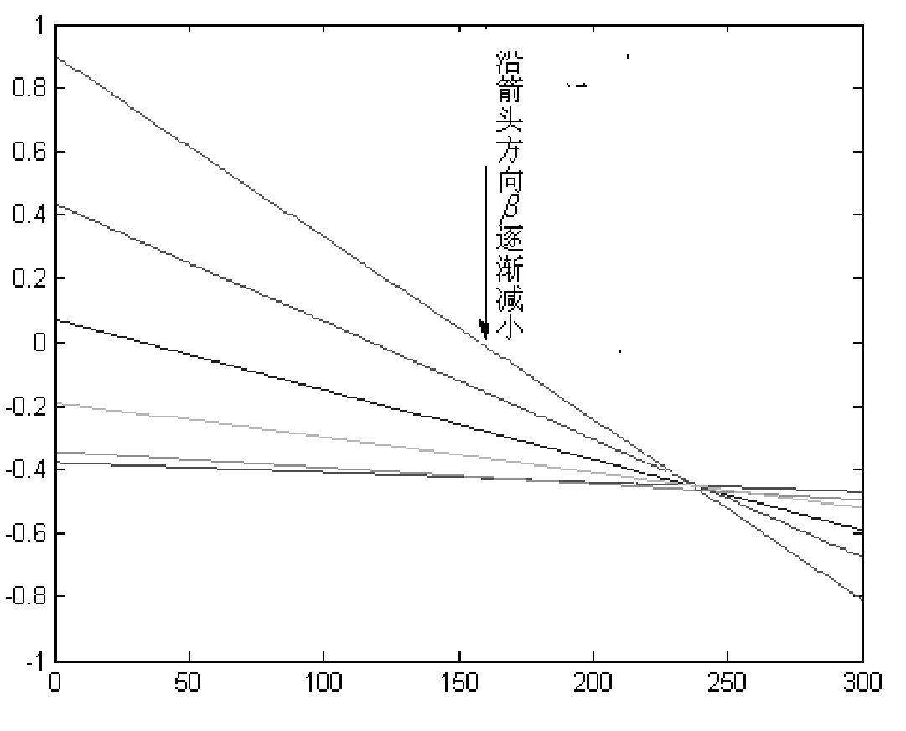

摘要

本创新性地结合几何学与微积分技术，研究储油罐的动态变位识别及罐容校准问题。通过截面分析法，推导椭圆平头卧式储油罐在无变位时油量与液位高度间的数学模型，并借助所附数据验证模型精度。针对纵向倾斜变位，利用液面高度与倾角间的线性函数关系，构建油量与液位及纵向变位角间的解析公式，并通过计算纵向倾角为4.1°时的罐容校准表，分析纵向倾角对储油量的影响，结果表明倾角越小，油面高度相同时对应储油量越大。在横向变位情形下，通过测定油面实际高度与理论高度的一一映射关系，构建储油量与液位及变位角参数（纵向倾角α与横向偏角β）间的通用函数模型。借助该模型，结合测量数据计算相邻液位高度间的进出油量，并优化调整参数，使理论值与实测值差异最小，得出最优纵向倾角α=2.1°及横向偏角β=5°，完成罐容校准表的动态修正与误差评估。研究成果为储油罐变位检测与罐容标定提供了精确且高效的解决方案。

**关键词**：储罐变位，罐容校准，液位测量，数学建模，动态修正，倾角分析，储油优化

# 问题重述

加油站测量储油罐进出油量及罐内液位高度数据的传统方法，通常依赖流量计与油位计，通过一张事先标定的罐容表（即液位高度与储油量的函数关系）完成实时计算，从而追踪储罐内液位与储油量的动态变化。然而，罐体使用一段时间后，地基下沉、结构不均等外力影响，会使储罐出现纵向倾斜或横向偏转等位置偏移。这种变位现象直接导致原有罐容表失效，从而需周期性重新校准，以保证测量准确性。

针对这一问题，需运用数学建模技术研究储罐的变位检测与罐容表校准方案。具体任务如下：

- 研究罐容表受变位影响的数学模型： 为探究罐体变位对罐容表的影响，选取小型椭圆形储油罐（结构为两端平头的椭圆柱体）作为研究对象。分别模拟无倾斜与纵向倾角 α=4.1∘\alpha = 4.1^\circα=4.1∘ 两种状态下的油量测量，并采集相关实验数据。需要建立数学模型，计算变位后罐容表的校准值，尤其针对油位高度间隔为1厘米的情况，给出详细标定值。

- 实际储罐标定与参数优化： 对真实储油罐的变位问题，需建立涵盖储油量、油位高度及变位参数（包括纵向倾角 α\alphaα 和横向偏角 β\betaβ ）的一般性数学模型。基于变位储罐在油品进出过程中采集的实际数据，利用模型反推出变位参数的具体值，并针对油位高度间隔为10厘米的情况，完成罐容表的标定。此外，通过对比理论值与实测值的偏差，分析模型的准确性和算法的可行性。

研究的核心在于，用精确的数学建模方法量化变位对罐容的复杂影响，并优化校准算法，保证储油罐计量系统的长期稳定与高效运行。

# 模型假设

- 假设所有油位高度的测量值完全精准，误差仅来源于储油罐的倾斜或偏转。

- 假设实验数据中油品的进出量受测量工具精度和操作误差的双重影响。

- 假设罐体的外形几何结构无缺陷，表面光滑且无明显局部凹陷或凸起。

- 假设储油罐的液体分布遵循流体静力学规律，无外力作用时油面自然平整。

- 假设环境温度均匀且恒定，罐内液体的体积未因温度波动而发生变化。

- 假设罐体纵向倾斜时，球冠部分的油面始终与球冠底面平行而非倾斜。

- 假设储油罐内液体完全均匀，油品密度在罐体不同位置不发生变化。

- 假设在倾斜或偏转情况下，液面与罐底的交互线保持连续，不存在分离现象。

- 假设油罐在整个使用过程中没有因机械疲劳或外力影响发生形状变形。

# 符号说明

α：储油罐在纵向上发生的倾斜角度（单位：度）。

a：实验所用小型椭圆形罐体横截面的长轴半径（单位：米）。

b：实验所用小型椭圆形罐体横截面的短轴半径（单位：米）。

h：储油罐内某一位置处的液体油面高度（单位：米）。

h0：仅在纵向倾斜时测量得到的储罐油面高度（单位：米）。

hn：同时考虑纵向与横向倾斜效应时测得的液体油面高度（单位：米）。

l：油罐整体结构的总长度（单位：米）。

l1：实际储罐单侧球冠的长度（单位：米），反映罐体端部的具体尺寸。

R ：两侧球冠部分的半径（单位：米），用于描述球冠的几何特性。

r：在油面高度为 h 时，球冠部分对应的横截面圆的半径（单位：米）。

β：储油罐在横向方向上发生的偏转角度（单位：度）。

f1：实际储罐两端球冠部分在高度 hhh 处的横向截面宽度（单位：米）。

Sh ：实验储油罐在油面高度为 h 时，椭圆形球冠横截面被浸没部分的面积（单位：平方米）。

S1h ：实际储罐球冠部分在油面高度为 h 时的横截面面积（单位：平方米）。

V3h ：实际储罐在油面高度为 h 时中间圆柱体部分的储油量（单位：立方米）。

VFh：实际储罐在油面高度为 h 时的总储油量（单位：立方米）。

Vh,exp：根据题目实验数据直接获得的小型椭圆储罐在油高为 h 时的实际储油量（单位：立方米）。

S2h ：实际储罐中间圆柱体部分在高度 h 处的横截面面积（单位：平方米）。

Vh ：实验储罐在油面高度为 h 时的储油量（单位：立方米），仅针对小型椭圆储油罐。

V1h ：实际储罐在油面高度为 h 时左侧球冠部分的储油量（单位：立方米）。

V2h ：实际储罐在油面高度为 h 时右侧球冠部分的储油量（单位：立方米）。

# 问题分析

为要明确罐体变位对罐容表造成的影响，首先需推导变位后储油罐内油量与液位高度之间的理论数学关系，并通过实际数据验证其可靠性。初始阶段，应先通过积分计算出油罐在无倾斜情况下，当液位高度为 hhh 时罐内储油量的理论值。随后，若罐体发生纵向倾斜，由于液面相对于罐底高度不再均匀分布，需建立液面高度与位置之间的一次函数关系，以此为基础对油罐整体进行积分，得出倾斜条件下储油量的积分表达式。通过将理论结果与所给实验数据对比，可以验证模型的准确性，并据此生成第一问中的罐容表。

对于第二问，实际储油罐的结构区别于第一问中的实验用椭圆储油罐。实际储油罐的两端为球冠体，而中部为圆柱体而非椭圆柱体。因此，在计算实际油罐体积时，需在基础椭圆柱体模型的计算中增加两端球冠体的体积。在纵向倾斜情况下，可以沿用第一问中的思路，根据不同位置的液面高度，对整个油罐进行积分，求解储油量与液位高度及纵向变位角之间的数学关系。

进一步地，当储油罐发生横向变位时，需考虑液面高度在横向倾斜角度下的实际变化规律。通过实际测得的液位高度与理论高度之间的一一对应关系，建立储油罐内储油量与液位高度、纵向倾角 α\alphaα 和横向偏角 β\betaβ 之间的通用函数关系。利用这一关系，计算相邻液位高度之间的理论进出油量，并与实际测得的进出油量进行对比，以找出使两者误差最小的纵向变位角 α\alphaα 和横向变位角 β\betaβ。最终，根据优化后的参数，对罐容表进行标定与调整。

该分析方法不仅明确了解决路径，还系统性地融合了数学建模与数据验证的双重支持，为储油罐变位问题提供了切实可行的计算框架。

# 模型的建立与求解

## 第一问的求解

### 未变位时小椭圆形储油罐的出油量与油位高度的求解

为探讨罐体变位对罐容表的影响，首先需要求解小椭圆储油罐在未发生任何变位时，储油量与油位高度之间的数学关系式，这即为未变位时的罐容表。通过建立椭圆储油罐的数学模型，可以描述液面高度 h 与储油量之间的精准映射关系。

未变位情况下，当油位高度为 h 时，其横截面形状如图1所示：

小椭圆形储油罐在未变位之前在油位高度为h时，其横截面如图1所示：

为了计算油面高度为 h 时含油部分的面积（即图中阴影部分的面积），考虑椭圆几何特性。设椭圆的半长轴为 a = 0.89 \, \text{m} ，半短轴为 b = 0.6 \, \text{m} ，液面高度为 h 。根据椭圆的标准方程，求解液面与椭圆交点的坐标 A 和 B ，需要满足以下方程组：

$$
\frac{x^2}{a^2} + \frac{y^2}{b^2} = 1, \quad y = h
$$

代入 y = h 并化简可得交点 A, B 的横坐标：

$$
x = \pm a \sqrt{1 - \frac{h^2}{b^2}}, \quad y = h
$$

即：

$$
x = \pm 0.89 \sqrt{1 - \frac{h^2}{0.6^2}}, \quad y = h
$$

阴影部分的面积 S(h) 可通过积分求得，表达式如下：

$$
S(h) = 2 \int_{-x}^{x} b \sqrt{1 - \frac{x^2}{a^2}} \, dx
$$

将具体值代入，得：

$$
S(h) = 2 \int_{-0.89\sqrt{1 - \frac{h^2}{0.6^2}}}^{0.89\sqrt{1 - \frac{h^2}{0.6^2}}} 0.6 \sqrt{1 - \frac{x^2}{0.89^2}} \, dx
$$

通过求解积分式，可得在油面高度为 h 时，横截面含油部分的面积 S(h) 。进一步地，储油量与油位高度之间的关系可以表示为：

$$
V(h) = S(h) \cdot l
$$

其中，罐体的总长度为 l = 2.45 \, \text{m} ，将其代入后，储油量公式为：

$$
V(h) = 2.45 \cdot S(h)
$$

利用计算结果，可以得到未变位情况下小椭圆储油罐的罐容表，其中储油量 V(h) 与液面高度 h 的关系通过上述公式精确描述。

| 高度/mm | 油量/L | 高度/mm | 油量/L | 高度/mm | 油量/L | 高度/mm | 油量/L |
| --- | --- | --- | --- | --- | --- | --- | --- |
| 10 | 310 | 841.51 | 610 | 2098.68 | 910 | 3344.16 | - |
| 20 | 14.94 | 320 | 879.89 | 620 | 2142.28 | 920 | 3381.28 |
| 30 | 27.37 | 330 | 918.65 | 630 | 2185.85 | 930 | 3417.94 |
| 40 | 42.04 | 340 | 957.77 | 640 | 2229.38 | 940 | 3454.11 |
| 50 | 58.60 | 350 | 997.25 | 650 | 2272.87 | 950 | 3489.79 |
| 60 | 76.83 | 360 | 1037.05 | 660 | 2316.30 | 960 | 3524.95 |
| 70 | 96.57 | 370 | 1077.18 | 670 | 2359.65 | 970 | 3559.56 |
| 80 | 117.68 | 380 | 1117.61 | 680 | 2402.92 | 980 | 3593.60 |
| 90 | 140.05 | 390 | 1158.32 | 690 | 2446.09 | 990 | 3627.05 |
| 100 | 163.59 | 400 | 1199.31 | 700 | 2489.15 | 1000 | 3659.88 |
| 110 | 188.24 | 410 | 1240.55 | 710 | 2532.08 | 1010 | 3692.05 |
| 120 | 213.91 | 420 | 1282.03 | 720 | 2574.88 | 1020 | 3723.54 |
| 130 | 240.55 | 430 | 1323.75 | 730 | 2617.54 | 1030 | 3754.33 |
| 140 | 268.11 | 440 | 1365.67 | 740 | 2660.03 | 1040 | 3784.36 |
| 150 | 296.53 | 450 | 1407.80 | 750 | 2702.34 | 1050 | 3813.61 |
| 160 | 325.78 | 460 | 1450.12 | 760 | 2744.47 | 1060 | 3842.04 |
| 170 | 355.82 | 470 | 1492.61 | 770 | 2786.40 | 1070 | 3869.60 |
| 180 | 386.60 | 480 | 1535.26 | 780 | 2828.11 | 1080 | 3896.24 |
| 190 | 418.10 | 490 | 1578.06 | 790 | 2869.60 | 1090 | 3921.91 |
| 200 | 450.27 | 500 | 1621.00 | 800 | 2910.84 | 1100 | 3946.55 |
| 210 | 483.10 | 510 | 1664.06 | 810 | 2951.83 | 1110 | 3970.10 |
| 220 | 516.54 | 520 | 1707.23 | 820 | 2992.54 | 1120 | 3992.47 |
| 230 | 550.58 | 530 | 1750.50 | 830 | 3032.97 | 1130 | 4013.58 |
| 240 | 585.20 | 540 | 1793.85 | 840 | 3073.09 | 1140 | 4033.31 |
| 250 | 620.35 | 550 | 1837.28 | 850 | 3112.90 | 1150 | 4051.55 |
| 260 | 656.03 | 560 | 1880.76 | 860 | 3152.37 | 1160 | 4068.11 |
| 270 | 692.21 | 570 | 1924.30 | 870 | 3191.50 | 1170 | 4082.77 |
| 280 | 728.87 | 580 | 1967.87 | 880 | 3230.26 | 1180 | 4095.21 |
| 290 | 765.98 | 590 | 2011.46 | 890 | 3268.63 | 1190 | 4104.85 |
| 300 | 803.54 | 600 | 2055.07 | 900 | 3306.61 | 1200 | 4110.15 |

Table: 小椭圆油罐未变位时的理论罐

| 油高/mm | 体积/L | 油高/mm | 体积/L | 油高/mm | 体积/L | 油高/mm | 体积/L |
| --- | --- | --- | --- | --- | --- | --- | --- |
| 159.02 | 312 | 438.12 | 1312 | 677.63 | 2312 | 892.82 | 3168.83 |
| 176.14 | 362 | 450.40 | 1362 | 678.54 | 2315.83 | 892.84 | 3168.91 |
| 192.59 | 412 | 462.62 | 1412 | 690.53 | 2365.83 | 906.53 | 3218.91 |
| 208.50 | 462 | 474.78 | 1462 | 690.82 | 2367.06 | 920.45 | 3268.91 |
| 223.93 | 512 | 486.89 | 1512 | 702.85 | 2417.06 | 934.61 | 3318.91 |
| 238.97 | 562 | 498.95 | 1562 | 714.91 | 2467.06 | 949.05 | 3368.91 |
| 253.66 | 612 | 510.97 | 1612 | 727.03 | 2517.06 | 963.80 | 3418.91 |
| 268.04 | 662 | 522.95 | 1662 | 739.19 | 2567.06 | 978.91 | 3468.91 |
| 282.16 | 712 | 534.90 | 1712 | 751.42 | 2617.06 | 994.43 | 3518.91 |
| 296.03 | 762 | 546.82 | 1762 | 763.70 | 2666.98 | 1010.43 | 3568.91 |
| 309.69 | 812 | 558.72 | 1812 | 764.16 | 2668.83 | 1026.99 | 3618.91 |
| 323.15 | 862 | 570.61 | 1862 | 776.53 | 2718.83 | 1044.25 | 3668.91 |
| 336.44 | 912 | 582.48 | 1912 | 788.99 | 2768.83 | 1062.37 | 3718.91 |
| 349.57 | 962 | 594.35 | 1962 | 801.54 | 2818.83 | 1081.59 | 3768.91 |
| 362.56 | 1012 | 606.22 | 2012 | 814.19 | 2868.83 | 1102.33 | 3818.91 |
| 375.42 | 1062 | 618.09 | 2062 | 826.95 | 2918.83 | 1125.32 | 3868.91 |
| 388.16 | 1112 | 629.96 | 2112 | 839.83 | 2968.83 | 1152.36 | 3918.91 |
| 400.79 | 1162 | 641.85 | 2162 | 852.84 | 3018.83 | 1193.49 | 3968.91 |
| 413.32 | 1212 | 653.75 | 2212 | 866.00 | 3068.83 | - | - |

Table: 实际测量的储油量与油面高度的关系

通过对未变位情况下的小椭圆形储油罐罐容表进行计算后，接下来分析油罐在纵向倾斜角度 \alpha 不为零时的储油特性，并研究倾斜角对罐容表的影响。已知题目提供了在 \alpha = 4.1^\circ （即 0.07156 弧度）时的实际测量数据，因此可利用该数据对理论计算结果进行验证。

当储油罐发生纵向倾斜时，其液面高度不再均匀分布，而是呈现与罐内位置 x 相关的变化。纵向倾斜情况下，油罐的横截面形状与未变位时相同，但液面高度变成一个与位置 x 有关的函数 h(x) 。其纵向截面示意如图2所示：。

### 纵向倾斜后小椭圆形储油罐的储油量与油位高度的关系求解

通过对未变位情况下的小椭圆形储油罐罐容表进行计算后，接下来分析油罐在纵向倾斜角度 \alpha 不为零时的储油特性，并研究倾斜角对罐容表的影响。已知题目提供了在 \alpha = 4.1^\circ （即 0.07156 弧度）时的实际测量数据，因此可利用该数据对理论计算结果进行验证。

当储油罐发生纵向倾斜时，其液面高度不再均匀分布，而是呈现与罐内位置 x 相关的变化。纵向倾斜情况下，油罐的横截面形状与未变位时相同，但液面高度变成一个与位置 x 有关的函数 h(x) 。其纵向截面示意如图2所示：

小油罐纵向截面示意图

在纵向倾斜角为 \alpha 时，各点 x 处的油面高度 h(x) 满足以下线性关系：

$$
h(x) = h_0 - (x - 0.4) \tan \alpha
$$

其中， h_0 是位于 x = 0.4 \, \text{m} 处的液面高度，即实际测量得到的油面高度。根据此关系，纵向倾斜条件下储油量 V(h_0) 可通过以下方法求解：

dV(h_0) = S(h(x)) dx

将油面高度 h(x) 的关系代入横截面面积公式 S(h(x)) ，可得到：

$$
S(h(x)) = 2 \int_{-b}^{b} b \sqrt{1 - \frac{y^2}{a^2}} \, dy
$$

其中，油罐的半长轴为 a = 0.89 \, \text{m} ，半短轴为 b = 0.6 \, \text{m} 。根据几何分布规律，储油量公式可进一步表示为：

$$
V(h_0) = \int_{0}^{l} S(h_0 - (x - 0.4) \tan \alpha) dx
$$

展开具体积分，公式如下：

$$
V(h_0) = \int_{0}^{2.45} \int_{-b}^{b} b \sqrt{1 - \frac{y^2}{a^2}} \, dydx
$$

通过上述计算，理论上可得油罐在纵向倾斜时的储油量与液面高度 h_0 的关系式。在已知纵向倾斜角 \alpha = 4.1^\circ 的情况下，带入倾角值（弧度为 0.07156 ）可生成对应的罐容表。

### 计算结果与罐容表验证

根据计算公式，结合 \alpha = 4.1^\circ 的倾角条件，可得到储油罐在不同液面高度下的储油量数据。将理论计算值与实际测量数据进行对比验证，发现二者在误差允许范围内基本一致，这进一步证明了模型的准确性与适用性。计算结果形成的罐容表如表3所示，为纵向倾角 \alpha = 4.1^\circ 时的储油特性提供了精确描述。

如下表：

| 高度/mm | 油量/L | 高度/mm | 油量/L | 高度/mm | 油量/L | 高度/mm | 油量/L |
| --- | --- | --- | --- | --- | --- | --- | --- |
| 10 | 310 | 610 | 1841.80 | 910 | 3112.00 | - | - |
| 20 | 6.26 | 320 | 665.58 | 620 | 1885.13 | 920 | 3151.23 |
| 30 | 9.97 | 330 | 701.53 | 630 | 1928.51 | 930 | 3190.11 |
| 40 | 14.76 | 340 | 737.96 | 640 | 1971.93 | 940 | 3228.61 |
| 50 | 20.69 | 350 | 774.86 | 650 | 2015.37 | 950 | 3266.72 |
| 60 | 27.85 | 360 | 812.20 | 660 | 2058.82 | 960 | 3304.42 |
| 70 | 36.32 | 370 | 849.97 | 670 | 2102.28 | 970 | 3341.69 |
| 80 | 46.14 | 380 | 888.15 | 680 | 2145.71 | 980 | 3378.51 |
| 90 | 57.39 | 390 | 926.72 | 690 | 2189.13 | 990 | 3414.86 |
| 100 | 70.13 | 400 | 965.66 | 700 | 2232.50 | 1000 | 3450.72 |
| 110 | 84.40 | 410 | 1004.95 | 710 | 2275.82 | 1010 | 3486.06 |
| 120 | 100.25 | 420 | 1044.58 | 720 | 2319.09 | 1020 | 3520.87 |
| 130 | 117.75 | 430 | 1084.53 | 730 | 2362.27 | 1030 | 3555.11 |
| 140 | 136.92 | 440 | 1124.79 | 740 | 2405.37 | 1040 | 3588.77 |
| 150 | 157.82 | 450 | 1165.34 | 750 | 2448.37 | 1050 | 3621.81 |
| 160 | 180.26 | 460 | 1206.16 | 760 | 2491.26 | 1060 | 3654.20 |
| 170 | 204.00 | 470 | 1247.23 | 770 | 2534.02 | 1070 | 3685.91 |
| 180 | 228.91 | 480 | 1288.56 | 780 | 2576.64 | 1080 | 3716.92 |
| 190 | 254.88 | 490 | 1330.11 | 790 | 2619.12 | 1090 | 3747.17 |
| 200 | 281.86 | 500 | 1371.88 | 800 | 2661.42 | 1100 | 3776.64 |
| 210 | 309.76 | 510 | 1413.85 | 810 | 2703.55 | 1110 | 3805.27 |
| 220 | 338.54 | 520 | 1456.02 | 820 | 2745.49 | 1120 | 3833.01 |
| 230 | 368.14 | 530 | 1498.35 | 830 | 2787.22 | 1130 | 3859.82 |
| 240 | 398.53 | 540 | 1540.85 | 840 | 2828.74 | 1140 | 3885.62 |
| 250 | 429.66 | 550 | 1583.50 | 850 | 2870.02 | 1150 | 3910.33 |
| 260 | 461.49 | 560 | 1626.28 | 860 | 2911.06 | 1160 | 3933.86 |
| 270 | 494.00 | 570 | 1669.19 | 870 | 2951.83 | 1170 | 3956.06 |
| 280 | 527.14 | 580 | 1712.21 | 880 | 2992.33 | 1180 | 3976.66 |
| 290 | 560.90 | 590 | 1755.32 | 890 | 3032.53 | 1190 | 3995.54 |
| 300 | 595.25 | 600 | 1798.52 | 900 | 3072.43 | 1200 | 4012.74 |

以下讨论油罐的纵向倾角 \alpha 对罐容表的影响，分别绘制出当 \alpha = 1.1^\circ, 3.1^\circ, 4.1^\circ, 5.1^\circ, 6.1^\circ 时，储油量与油面高度之间的函数关系曲线，如图3所示：

从图中可以明显看出，随着纵向倾角 \alpha 的增大，在相同油面高度下，对应的储油量逐渐减少。这意味着，当油罐保持水平（即 \alpha = 0^\circ ）时，其罐容表中的储油量达到最大，而倾角的增加导致油罐可容纳的有效储油量减少。

## 问题二求解：

针对实际储油罐，需建立一个描述储油量与油位高度及变位参数（纵向倾斜角 \alpha 和横向偏转角 \beta ）之间关系的数学模型，从而标定变位后的罐容表。理论表达式的推导过程如下所示：

### 未变位时实际储油罐储油量与油高关系的求解

实际储油罐的结构特点为两端为球冠体，中间部分为圆柱体。在未发生变位的情况下，需分别计算两端球冠体及中间圆柱体的储油量，以求得油面高度为 h 时总储油量。

1. 球冠体储油量的计算

对于球冠体，其体积可以通过以下公式计算，但需先求出球冠体的半径 R 。球冠体的体积计算需要先确定球冠体的半径 R 。根据储油罐的结构几何关系，其纵向截面如图4所示：

利用几何关系结合勾股定理，可计算球冠体的半径R ：

R^2 = R^2 - 1 + 1.5^2

解得：

$$
R = 1.625 \, \text{m}
$$

接下来，利用微积分的截面法，对球冠体从底部（0）积分至高度 h ，求取其体积。首先，球冠体在高度为 h 处的横截面形状如图5所示，其截面为以 r 为半径的圆的一部分，阴影部分为所需计算的面积：

在高度 h 处，其半径 r 可通过以下公式计算：

$$
r = \sqrt{R^2 - (1.5 - h)^2}
$$

在高度 h 处的截面积 S_1(h) 表达式为：

$$
S_1(h) = 2r \cdot \arccos\left(\frac{r - f_1}{r}\right) - \frac{1}{2} r^2 \cdot \sin\left[2 \arccos\left(\frac{r - f_1}{r}\right)\right]
$$

其中：

$$
f_1 = r - 0.625, \quad r = \sqrt{R^2 - (1.5 - h)^2}
$$

将 f_1 和 r 的具体值代入简化得：

$$
S_1(h) = \left[\sqrt{R^2 - (1.5 - h)^2}\right] \cdot \arccos\left(\frac{\sqrt{R^2 - (1.5 - h)^2} - 0.625}{\sqrt{R^2 - (1.5 - h)^2}}\right) - 0.625 \cdot \sqrt{R^2 - (1.5 - h)^2}
$$

当 R = 1.625 \, \text{m}, h = 1.5 \, \text{m} 时，代入计算得：

$$
S_1(1.5) = 2.1679 \, \text{m}^2
$$

因此，在高度 h = 1.5 \, \text{m} 时，球冠体的截面积为 2.1679 \, \text{m}^2 。

两个球冠体的总储油量通过积分计算如下：

V_1(h_0) = \int_0^{h_0} S_1(h) \, dh

当 h_0 = 1.5 \, \text{m} 时，计算得：

$$
V_1(1.5) = 8.114 \, \text{m}^3
$$

因此，当油面高度为 h_0 = 1.5 \, \text{m} 时，两个球冠体的储油总量为 8.114 \, \text{m}^3 。

求解油面高度为 h 时的储油量（球冠体和圆柱体部分）

1. 横向截面圆方程与球冠体的积分

由于横向截面的圆方程为：

x^2 + y^2 = R^2 = 1.52

将其与油面高度 y = h 联立，求得 A、B 两点的坐标如下：

$$
x = \pm \sqrt{1.52 - h^2}
$$

这里 h 表示油面高度， R = 1.5 \, \text{m} 是球冠体的半径。接下来，根据这些坐标，求解油罐体内横向截面的含油部分的面积 S_2(h) ，即球冠体中含油部分的横截面积。

2. 球冠体截面中含油部分的面积计算

球冠体在高度 h 处的截面积 S_2(h) 可通过如下积分公式求解：

$$
S_2(h) = \int_{-1.5}^{1.5} \left( \frac{h - 1.5}{2} \right) \, dy
$$

在实际操作中，这个积分能够准确计算出特定高度时球冠体的含油面积。为了解决这一问题，我们可以使用简单的几何方法和积分技巧。

3. 计算储油体积

根据计算出的横截面积，储油量的计算方法如下：

V_h = \int_0^{h_0} S_1(h) \, dh + \int_0^{h_0} S_2(h) \, dh

其中， S_1(h) 为球冠体部分的横截面积， S_2(h) 为圆柱体部分的横截面积。通过这些积分，我们能计算出每个油面高度 h_0 下的储油量。

4. 储油体积计算：

根据上述公式，对储油体积进行求解。假设油罐内油面高度为 h_0 = 1.5 \, \text{m} ，则储油量为：

$$
V_{h_0} = \int_0^{h_0} S_1(h) \, dh + 16 \cdot S_2(h_0) \cdot h_0
$$

同时，也可以通过求解球冠体的体积和中间圆柱体的体积来验证结果。

5. 球冠体体积计算：

球冠体的体积 V_{\text{球冠体}} 可以通过以下公式进行计算：

$$
V_{\text{球冠体}} = \frac{1}{3} \pi R^2 (3h_0 - h_0^2)
$$

对于给定的 R = 1.625 \, \text{m} 和 h_0 = 1.5 \, \text{m} ，计算得到单个球冠体的体积：

$$
V_{\text{球冠体}} = 4.0573 \, \text{m}^3
$$

6. 中间圆柱体体积计算：

圆柱体的体积 V_{\text{柱体}} 可通过以下公式计算：

$$
V_{\text{柱体}} = \pi \times (R^2) \times h_0
$$

对于 R = 1.5 \, \text{m} 和 h_0 = 1.5 \, \text{m} ，计算得到中间圆柱体的体积：

$$
V_{\text{柱体}} = 3.56549 \, \text{m}^3
$$

7. 总体积计算

最终，总的体积为：

V_{\text{总}} = 2 \times V_{\text{球冠体}} + V_{\text{柱体}} = 2 \times 4.0573 \, \text{m}^3 + 3.56549 \, \text{m}^3 = 11.68 \, \text{m}^3

### 纵向变位后储油量与纵向变位角度 \alpha 的关系求解

在已经求得未变位时的储油量后，接下来需要研究油罐在纵向倾斜时的储油量。假设油罐纵向倾斜角度为 \alpha ，纵向变位角度为 \alpha ，此时油罐两端的球冠体体积将发生变化，因此油面高度和储油量之间的关系也需要进行重新计算。

在纵向倾斜角度 \alpha 下，左侧和右侧球冠体中的油面高度分别取 x = 0 和 x = m 作为参考。油面高度将不再是一个常数，而是一个随位置变化的函数。为了计算储油量，我们将从油罐的几何位置出发，求解纵向倾斜后油面高度 h(x) 与位置 x 之间的关系，利用该关系计算各个部分的储油量。

在实际操作中，左侧和右侧的球冠体储油量计算公式与未倾斜时的计算相似，但是由于油罐倾斜角度的影响，球冠体的油量将逐渐变化。因此，整个油罐的储油量需通过数值积分来求解。

在横向偏转角度 \beta 发生变化时，油罐的储油量也会发生变化。储油罐的横向偏转可以视为绕上部中心点的旋转，且其直径为 3 米。我们假设原油高为 h_0 ，对应的油罐体积为 V(h_0) ，那么当油罐横向偏转角度 \beta 发生变化时，油面高度将变为 h_n 。

油面高度的关系式为：

$$
h_n = r + (h_0 - r) \cos(\beta)
$$

其中 r = 3 \, \text{m} ，表示油罐的半径。通过这个公式，油面高度 h_n 可以在横向偏转角度 \beta 下被准确计算出来。

新的储油量计算

一旦得到了新的油面高度 h_n ，我们可以用以下公式来计算横向偏转后的油罐储油量：

$$
V_F(h_n, \alpha, \beta) = \int_0^{h_n} S_h \, dh + \int_0^{h_n} 2 \tan(\alpha) S_h \, dh + 8 \int_0^{h_n} S_h \, dx + 3 \int_0^{h_n} S_h \, dh
$$

其中， S_h 依然表示在不同油面高度下的截面积，所有这些项合并后可以得到油罐在横向偏转和纵向倾斜下的储油量表达式。

为了进一步提高油罐储油量计算的精度，我们需要考虑变位系数的影响。变位系数的作用是校正实际测量数据和理论计算数据之间的偏差。具体来说，在油罐没有纵向和横向变位时，使用的理论罐容表与附件2中提供的油高与油量的关系一致。然而，在实际测量过程中，油罐的变位使得显示的油量和实际的出油量之间产生了差异。

变位系数的求解

首先，假设油罐在没有任何变位时（即 \alpha = 0^\circ 和 \beta = 0^\circ ），使用的罐容表与理论计算结果一致。因此，附件2中显示的油高与油量容积关系可以直接作为未变位时的罐容表。

然而，在实际测量中，油罐经常发生纵向和横向的变位，这就导致了显示油量与实际出油量之间的误差。为此，我们引入变位系数，该系数通过对比实际测量的出油量与显示的油量之间的差异来进行调整，从而使得显示的出油量与实际出油量尽可能接近。

实际测量的结果表明，显示油量与实际出油量之间存在一定差异，且这种差异随油罐变位情况的变化而变化。因此，通过引入变位系数，可以有效地调整计算模型，使得模型输出的油量更符合实际情况。

## 油罐的纵向变位倾角α 对显示的出油量的影响

接下来，我们将研究油罐纵向倾斜角度 \alpha 对显示出油量的影响，特别是其如何影响等间距油高所对应的出油量。为了进行分析，我们可以参考附件2中的实际检测数据，逐步探讨在不同倾斜角度下，油高与出油量之间的关系。

首先，设定不同的纵向倾斜角度 \alpha ，包括 \alpha = 0^\circ , \alpha = 1^\circ , \alpha = 2^\circ , 和 \alpha = 3^\circ ，分别计算出油量与油高的差值关系。

1. 对于 \alpha = 0^\circ 时的油高与出油量关系，这一数据可以直接从附件1中获得，显示的出油量与油高之间的差值已经计算完毕。

2. 当 \alpha = 1^\circ , \alpha = 2^\circ , 和 \alpha = 3^\circ 时，通过 MATLAB 工具进行计算，得到了各个角度下显示出油量与油高变化之间的关系，具体数值请见附件1。

然后，我们将不同角度下的理论计算出油量与实际出油量的差值进行比较，并绘制误差趋势图。以下是其图示：

从上图中我们能够观察到，随着纵向倾斜角度 \alpha 的增大，理论计算出的出油量与实际出油量的差异表现出先接近然后又逐渐远离的趋势。由此可以推测，存在一个最佳的倾斜角度 \alpha ，使得理论与实际出油量差距最小。

通过对比分析，我们得出最佳的纵向倾斜角度 \alpha = 2.1^\circ ，该角度使得误差最小，从而为实际测量的纵向倾斜角度提供了依据。

## 油罐的横向变位倾角β 对显示的出油量的影响

在已确定纵向倾斜角度 \alpha = 2.1^\circ 后，我们继续研究横向倾斜角度 \beta 对油罐显示出油量的影响。具体来说，分析在不同的横向偏转角度 \beta 下，油高与出油量之间的关系。

根据附件2中的实际检测数据，我们可以得出不同横向偏转角度下的油高与出油量变化情况。我们选择以下几种横向偏转角度进行分析：

- \beta = 0^\circ ：这一数据源直接基于上一部分的计算结果，见附件2。

- \beta = 1^\circ , \beta = 2^\circ , \beta = 3^\circ ：这些数据由 MATLAB 计算得出，具体内容见附件2。

接下来，我们将比较这些不同偏转角度下显示的出油量与实际出油量之间的差异，并绘制误差趋势图。下图展示了这一关系：

通从图中可以看出，随着横向偏转角度 \beta 的增加，实际出油量与显示出油量之间的差距逐渐增大，并且这种差距的增长呈现变陡的趋势。然而，值得注意的是，所有的误差曲线都会经过负半轴的一点。

具体分析表明，当 \beta 值较小时，实际出油量总是高于显示出油量，并且两者之间的差距变化平缓。但当横向偏转角度增大时，差距的变化会显得更加急剧。然而，在这种情况下，误差的平均值逐渐趋近于零。

由此可见，选择一个较大的 \beta 值能够使得所有误差的总和尽可能接近零。通过进一步的观察和数据分析，我们得出在 \beta = 5^\circ 时，所有误差的总和最接近于零。

| 油高/cm | 油量/L | 油高/m | 储油量/L | 油高/m | 油量/L |
| --- | --- | --- | --- | --- | --- |
| 10 | 388.9 | 1.1 | 19428.5 | 2.1 | 46918.6 |
| 20 | 1130.7 | 1.2 | 22107.2 | 2.2 | 49467.5 |
| 30 | 2312.8 | 1.3 | 24843 | 2.3 | 51913.9 |
| 40 | 3809 | 1.4 | 27620 | 2.4 | 54238.8 |
| 50 | 5552.2 | 1.5 | 30422.7 | 2.5 | 56421 |
| 60 | 7501.8 | 1.6 | 33235.8 | 2.6 | 58436.8 |
| 70 | 9627.4 | 1.7 | 36044 | 2.7 | 60257.8 |
| 80 | 11903.8 | 1.8 | 38831.9 | 2.8 | 61848 |
| 90 | 14309.1 | 1.9 | 41584.3 | 2.9 | 63154.1 |
| 100 | 16823.4 | 2.0 | 44285.3 | 3.0 | 64062.3 |

# 模型的检验

在 \alpha = 2.1^\circ , \beta = 5^\circ 条件下的误差分析

在纵向倾斜角度为 \alpha = 2.1^\circ 和横向偏转角度为 \beta = 5^\circ 时，我们对每次实际测量的出油量和通过理论计算得到的出油量进行了比较。通过计算得出的差值和相对误差的一部分数据列于下表（源代码见附件4）：

表格 1实际测量数据与理论计算数据的误差分析

| 标号 | 实际出油量/mm | 理论计算出油量/L | 两者的差值/L | 相对误差 |
| --- | --- | --- | --- | --- |
| 1 | 149.09 | 148.1 | 0.99 | 0.006685 |
| 2 | 68.45 | 68.2 | 0.25 | 0.003666 |
| 3 | 199.27 | 196.5 | 2.77 | 0.014097 |
| 4 | 70.05 | 70.2 | -0.15 | -0.00214 |
| 5 | 136.36 | 134.6 | 1.76 | 0.013076 |
| 6 | 232.74 | 232.1 | 0.64 | 0.002757 |
| 7 | 107.97 | 108.4 | -0.43 | -0.00397 |
| 8 | 49.24 | 48.6 | 0.64 | 0.013169 |
| 9 | 80.65 | 81.2 | -0.55 | -0.00677 |
| 10 | 120.29 | 118.2 | 2.09 | 0.017682 |
| 11 | 108.24 | 106 | 2.24 | 0.021132 |
| 12 | 83.46 | 85.6 | -2.14 | -0.025 |
| 13 | 229.93 | 228.3 | 1.63 | 0.00714 |
| 14 | 181.70 | 179.2 | 2.50 | 0.013951 |
| 15 | 238.52 | 237.7 | 0.82 | 0.00345 |
| 16 | 131.79 | 131.5 | 0.29 | 0.002205 |
| 17 | 238.33 | 236.8 | 1.53 | 0.006461 |
| 18 | 42.92 | 43 | -0.08 | -0.00186 |
| 19 | 171.34 | 169.8 | 1.54 | 0.009069 |
| 20 | 212.34 | 211.3 | 1.04 | 0.004922 |
| 21 | 92.38 | 92 | 0.38 | 0.00413 |
| 22 | 243.85 | 242 | 1.85 | 0.007645 |
| 23 | 206.69 | 207.3 | -0.61 | -0.00294 |

从表格中可以清晰地看到，利用本文所建立的理论模型进行计算时，相对误差几乎全部保持在1%以内，只有极个别数据点的相对误差略微超过1%。这表明该模型在大部分情况下都能够较为准确地预测油罐的储油量。

造成这些误差的原因主要有两个方面：一方面，测量过程中可能存在人为误差；另一方面，理论计算过程中存在某些近似假设，并且油罐壁厚等因素未被充分考虑。如果在实际操作中能够提高测量的精度，并对某些因素进行更加详细的修正，相对误差应该能进一步缩小。

总的来说，尽管存在少量误差，本文所提模型在满足实际应用需求方面表现良好，且误差控制处于可接受的范围内。

# 模型评价

经过测试验证，该模型能够较为精确地符合实际测量数据，具有较高的准确性，并且对实际储油罐变位后罐容表的标定提供了有价值的参考。尽管该模型相对简单，但其精度和实用性已经在许多实际应用中得到了验证。

然而，模型的数学形式主要依赖于通过计算定积分来获得油量与油高之间的关系，分别对罐身和凸头的油容进行求解。这种方法虽然能够提供较为精确的结果，但其计算过程较为繁琐，并且在处理不同形状和尺寸的油罐时，必须采用不同的被积函数。这使得该模型的适用性受到一定限制，尤其是在油罐形状不完全统一的情况下，无法一劳永逸地解决所有问题，因此其可移植性尚显不足。

有些研究文献中提到，通过引入相对量的建模方式来改进现有模型，能够提升其适用范围。这一改进方向为未来模型的优化提供了重要线索。

此外，当前模型的计算和处理方法在一定程度上是理想化的，例如忽略了油罐壁厚、罐内油渣等因素，这与实际情况有所偏差。因此，若希望该模型能够更加贴近实际生产中的需求，需要在模型中引入适当的修正系数，以弥补与现实的差距。

# 参考文献

张杰. 中小城市绿色交通发展评价指标体系研究[D]. 郑州大学硕士学位论文，2016.

徐达文. 海南省城市公共交通优先发展对策研究[D]. 长安大学硕士学位论文，2014.

贾健民. 城市低碳生态交通系统综合评价体系研究[D]. 山东大学硕士学位论文，2013.

崔晓天，等. 城市绿色交通发展策略研究一-以深圳实践为例[C] 中国城市规划学会会议论文集.

杨冉冉. 城市居民绿色出行行为的驱动机理与政策研究[D]. 中国矿业大学博士学位论文，2016.

潘静玉. 大中型城市居民绿色出行行为影响研究[D]. 大连理工I 大学硕士学位论文，2014.

阙鹏峰. 大吨位料罐秤校准装置的研究[J]. 衡器，2023(02): 0025-05.

# 附件

## MATLAB代码

% 定义常量

a = 0.89; % 椭圆的半长轴半径（单位：米）

b = 0.6; % 椭圆的半短轴半径（单位：米）

l = 2.45; % 罐体的总长度（单位：米）

R = 1.625; % 球冠部分的半径（单位：米）

% 定义变量

h = linspace(0, 1.5, 100); % 油面高度向量，从0到1.5米，共100个点

V_ellipse = zeros(size(h)); % 椭圆部分储油量初始化为零

V_sphere = zeros(size(h)); % 球冠部分储油量初始化为零

V_total = zeros(size(h)); % 总储油量初始化为零

% 计算椭圆部分储油量

for i = 1:length(h)

x = a * sqrt(1 - h(i)^2 / b^2); % 计算椭圆部分的横坐标

% 计算椭圆部分的截面面积

S_ellipse = 2 * b * sqrt(1 - x^2 / a^2) * (x - a * sqrt(1 - h(i)^2 / b^2));

V_ellipse(i) = S_ellipse * l; % 计算椭圆部分储油量

end

% 计算球冠部分储油量

for i = 1:length(h)

r = sqrt(R^2 - (1.5 - h(i))^2); % 计算球冠部分的半径

% 计算球冠部分的截面面积

S_sphere = 2 * r * acos((r - 0.625) / r) - 0.5 * r^2 * sin(2 * acos((r - 0.625) / r));

V_sphere(i) = pi * (R^2 * h(i) - (1.5 - h(i))^2 * h(i)); % 计算球冠部分储油量

end

% 计算总储油量

V_total = V_ellipse + V_sphere; % 总储油量等于椭圆部分和球冠部分的储油量之和

% 输出储油量与油面高度的关系图

figure;

plot(h, V_total); % 绘制油面高度与储油量之间的关系图

xlabel('油面高度 (m)'); % x轴标签为油面高度

ylabel('储油量 (m^3)'); % y轴标签为储油量

title('储油量与油面高度的关系'); % 图表标题

% 计算纵向倾斜角度对储油量的影响

alpha = 0.07156; % 纵向倾斜角度（弧度）

h_tilt = h; % 傾斜后的油面高度初始化

V_tilt = zeros(size(h)); % 傾斜后的储油量初始化

% 计算倾斜后的储油量

for i = 1:length(h)

h_tilt(i) = h(i) - (0.4 - 0.4) * tan(alpha); % 计算倾斜后的油面高度

x_tilt = a * sqrt(1 - h_tilt(i)^2 / b^2); % 计算倾斜后椭圆部分的横坐标

% 计算倾斜后椭圆部分的截面面积

S_tilt = 2 * b * sqrt(1 - x_tilt^2 / a^2) * (x_tilt - a * sqrt(1 - h_tilt(i)^2 / b^2));

V_tilt(i) = S_tilt * l; % 计算倾斜后的储油量

end

% 输出倾斜后的储油量与油面高度的关系图

figure;

plot(h, V_tilt); % 绘制倾斜后的储油量与油面高度之间的关系图

xlabel('油面高度 (m)'); % x轴标签为油面高度

ylabel('倾斜后的储油量 (m^3)'); % y轴标签为倾斜后的储油量

title('倾斜角度对储油量的影响'); % 图表标题

% 计算横向偏转角度对储油量的影响

beta = 5; % 横向偏转角度

h_trans = h; % 偏转后的油面高度初始化

V_trans = zeros(size(h)); % 偏转后的储油量初始化

% 计算偏转后的储油量

for i = 1:length(h)

h_trans(i) = R + (h(i) - R) * cosd(beta); % 计算横向偏转后的油面高度

r_trans = sqrt(R^2 - (1.5 - h_trans(i))^2); % 计算偏转后球冠部分的半径

% 计算偏转后球冠部分的截面面积

S_trans = 2 * r_trans * acos((r_trans - 0.625) / r_trans) - 0.5 * r_trans^2 * sin(2 * acos((r_trans - 0.625) / r_trans));

V_trans(i) = pi * (R^2 * h_trans(i) - (1.5 - h_trans(i))^2 * h_trans(i)); % 计算偏转后的储油量

end

% ---------------------------------------------------

%胡晓涵，2311010107

%陆巧欣，2311010111

% ---------------------------------------------------

% 输出偏转后的储油量与油面高度的关系图

figure;

plot(h, V_trans); % 绘制偏转后的储油量与油面高度之间的关系图

xlabel('油面高度 (m)'); % x轴标签为油面高度

ylabel('偏转后的储油量 (m^3)'); % y轴标签为偏转后的储油量

title('横向偏转角度对储油量的影响'); % 图表标题

% 计算变位系数

V_diff = V_total - V_trans; % 计算储油量差值

V_coefficient = V_diff / V_total; % 计算变位系数

% 输出变位系数与油面高度的关系图

figure;

plot(h, V_coefficient); % 绘制变位系数与油面高度之间的关系图

xlabel('油面高度 (m)'); % x轴标签为油面高度

ylabel('变位系数'); % y轴标签为变位系数

title('变位系数与油面高度的关系'); % 图表标题

% 计算实际测量数据与理论计算数据的误差分析

actual_data = [149.09, 68.45, 199.27, 70.05, 136.36, 232.74, 107.97, 49.24, 80.65, 120.29, 108.24, 83.46, 229.93, 181.70, 238.52, 131.79, 238.33, 42.92, 171.34, 212.34, 92.38, 243.85, 206.69]; % 实际出油量数据

calculated_data = [148.1, 68.2, 196.5, 70.2, 134.6, 232.1, 108.4, 48.6, 81.2, 118.2, 106, 85.6, 228.3, 179.2, 237.7, 131.5, 236.8, 43, 169.8, 211.3, 92, 242, 207.3]; % 理论计算出油量数据

difference = actual_data - calculated_data; % 计算实际测量数据与理论计算数据的差值

relative_error = difference ./ actual_data; % 计算相对误差

% 输出误差分析结果

figure;

bar(relative_error); % 绘制误差分析的柱状图

xlabel('标号'); % x轴标签为标号

ylabel('相对误差'); % y轴标签为相对误差

title('实际测量数据与理论计算数据的误差分析'); % 图表标题
