# 车道被占用对城市道路通行能力的影响

摘要

交通事故往往导致车道占用，进而影响道路的通行能力，严重情况下可导致交通堵塞。为了准确估算交通事故对城市道路通行能力的影响，本文围绕四个核心问题展开研究。

问题一：针对事故发生期间道路通行能力的估算，结合背景差分法、直方图均衡化、中值滤波法等图像处理技术，提取了视频数据中的车道流量，并计算了事故期间道路的理论通行能力与实际通行能力。结果表明，事故发生期间，实际通行能力在理论值附近波动，且这种波动符合正态分布。

问题二：针对交通事故所占车道对横断面通行能力的影响，本文通过正态检验和方差齐次检验后，利用方差分析得出结论：不同车道占用情况下，事故对通行能力的影响没有显著性差异。进一步的通径分析表明，影响横断面通行能力的主要因素为车道流量比例。

问题三：针对交通流排队长度的变化，本文使用城市交通二流理论计算事故持续时间与排队长度的关系，并运用非线性比例尺改进算法进一步统计排队长度。在此基础上，采用夹角余弦法对路段上游车流量与事故横断面实际通行能力的影响权重进行统一，并将事故持续时间作为输入样本，结合反向传播神经网络和遗传算法优化，构建了交通流排队长度预测模型。结果显示，排队长度随着排队时间的延长、车流量的增大以及通行能力的下降而不断增加。

问题四：针对事故发生后的交通流预测，本文基于元胞自动机构建了交通流预测模型。通过模拟仿真，发现事故发生后，在上游车流量变化不大的情况下，车辆排队长度将在8.3至9分钟内达到上游路口。通过引入红绿灯因素，改进后的模型表明，排队长度到达上游路口的时间缩短至8至8.4分钟，且排队长度的波动程度增大。
关键词：车道占用、交通流预测、背景差分法、通径分析、反向传播神经网络、遗传算法、元胞自动机、排队长度

# 问题重述

车道被占用是指由于交通事故、路边停车、占道施工等多种原因，导致车道或道路横断面在单位时间内的通行能力降低的现象。考虑到城市道路通常具有较大的交通流密度及强烈的连续性特点，即使只是其中一条车道被占用，也可能影响到整个路段的交通流通能力，导致即便短时间内，车辆也可能因排队而产生交通阻塞。而若这种情况得不到及时的处理，往往会导致更为严重的区域性交通拥堵。

车道被占用的情况通常多种多样且复杂，正确评估车道被占用对于城市道路通行能力的影响，可以为交通管理部门在引导交通流、审批占道施工、设计道路渠化方案、规划路边停车位、设置非港湾式公交车站等方面提供理论支持。

在视频 1（附件 1）和视频 2（附件 2）中，两个交通事故发生在同一路段的同一横断面，并且完全占用了两条车道。请研究以下几个问题：

- 根据视频 1（附件 1），描述视频中交通事故发生至撤离期间，事故所处横断面实际通行能力的变化过程。

- 根据问题 1 的结论，结合视频 2（附件 2），分析同一横断面上不同车道被占用情况对该横断面实际通行能力的影响差异。

- 假设视频 1（附件 1）中的交通事故发生在距上游路口 140 米处，且下游需求不变，上游车流量为 1500 pcu/h。事故发生时车辆排队长度为零，且事故未撤离。请估算，事故发生后，经过多长时间车辆排队长度将达到上游路口。

- 构建数学模型，分析视频 1（附件 1）中交通事故对路段车辆排队长度的影响，并探讨事故横断面实际通行能力、事故持续时间与路段上游车流量其内的关系。

# 模型假设

交通流量的考虑范围：仅考虑四轮及以上机动车和电瓶车的交通流量，并换算成标准车当量（PCU）。

车辆类型及其分类：车辆分为小型、中型和大型三类，且同一类车型其内差异较小。

事故对车流量的影响：上游车流量在事故持续期间不受影响，保持恒定。

路段交通流的时间变化：道路通行能力随时间变化，但与事故持续时间和占道量相关。

车辆排队与通行能力的关系：排队长度与事故持续时间、车流量和通行能力直接相关。

事故撤离与交通恢复的时间假设：事故清理后，交通流恢复速度与车道占用情况及清理速度相关。

车辆行驶行为与占道情况：车辆行驶速度受事故占道情况影响，减速幅度与占道程度和道路类型相关。

路段上游交通流量不等于通行能力：上游车流量受排队、信号控制等因素影响，不能直接等于通行能力。

环境因素假设：本模型假设环境因素（如天气、道路状况）不对交通流量产生显著影响。

# 符号说明

| 符号 | 意义 |
| --- | --- |
| Pb(k) | 灰度级 k 在图像中出现的概率 |
| fk | 直方图均衡法的变换函数 |
| D(x, y, tk) | 差异积累背景建模法的差异动态矩阵 |
| Nmax | 基本通行能力 |
| γi (i = 1,2,3,4,5,6) | 修正系数 |
| Nt | 理论通行能力 |
| Nx | 实际通行能力 |
| S0 | 初始时刻（t=0 时）上、下游断面其内的车辆数 |
| ∑3i=1 SU(i,t) | t 时刻通过上游断面的车辆累计数 |
| ∑3i=1 SD(i,t) | t 时刻通过下游断面的车辆累计数 |
| ΔS(t) | t 时刻上、下游断面其内的车辆数 |
| L | 上、下游断面其内的距离 |
| km | 上、下游断面其内的交通流最佳密度 |
| kj | 上、下游断面其内的交通流阻塞密度 |
| k(t) | t 时刻上、下游断面其内的平均单车道交通流密度 |
| ωf | 横断面实际通行能力、路段上游车流量的权重 |

# 数据获取与处理

### 数据获取

视频资料的采集过程中，存在多种干扰因素，或者由于光照不足与摄像机曝光不足，导致了图像质量的显著下降。如此一来，图像中车辆的特征信息变得模糊不清，随之而来的是后续分析计算的难度加大。

为有效计算事故发生至撤离期间的车辆通行情况，运用了Matlab图像处理算法，旨在对视频中的车辆进行精确检测与定位。鉴于人类的视觉系统对亮度变化较为敏感，因此，预先将视频中的所有图像转化为灰度图（灰度级为256），不仅能提升处理效率，而且减少了存储空间占用，从而有效降低后续算法的计算负担。

### 图像增强

图像增强的技术可归纳为两种主要类别：空域技术与频域技术。为确保图像处理能够实现实时操作，在此选用了两种空域方法，它们通过对图像灰度值直接进行计算处理来达成目的。

当图像的灰度级数量较多且分布较为均匀时，这样的图像通常表现出较高的对比度以及丰富多变的灰度变化。直方图均衡化正是通过仅依赖输入图像的直方图信息来自动达到这种效果的转换函数。其核心理念是，将在图像中频繁出现的灰度级拉伸，而将出现频率低的灰度级压缩，从而扩大图像像素值的动态范围，提升图像的对比度和灰度层次变化，使得图像更加清晰。

某一灰度级 k 在图像中出现的概率近似表示为：

$Pbk=fracnkn,quadk=0,1,2,\dots,255,quadsumk=0255Pbk=1$

其中，n 表示图像的像素总数， $nk$ 表示灰度级为 k 的像素数量。该变换函数可以表示为：

$fk=sumj=0kPbj$

直方图均衡化的实施过程具体如下：

1. 统计原始图像的每一灰度级 k，并列出每一灰度级的像素数量 $nk$ ；

2. 根据公式（1）计算每一灰度级的分布概率，并使用公式（2）计算每个灰度级的累积分布函数（CDF）；

3. 根据映射关系计算出直方图均衡化后的像素值，最终得到处理后的图像像素值为 $255timesfk。$

通过这些步骤，直方图均衡化能够有效地提升图像的视觉效果，使其呈现更高的对比度和更加丰富的灰度变化。

使用 Matlab 进行处理得到直方图均衡化的图像左下图，原图像如右下图：

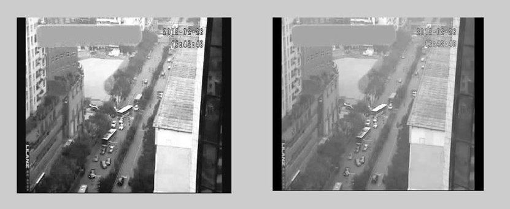

从分析可以得出结论，经过直方图均衡化处理后，图像的效果显著提升，且对比度更为突出。

鉴于图像中存在噪声，为了增强图像的清晰度，必须有效地抑制这些噪声。常用的噪声抑制方法包括领域平均法滤波和中值滤波。然而，领域平均法滤波作为一种低通滤波器，可能会导致带有高频信息的边缘变得模糊不清。因此，在此场景下，选择了中值滤波法来抑制噪声，不仅保持了图像的清晰度，同时也有效保护了边缘轮廓的细节信息。

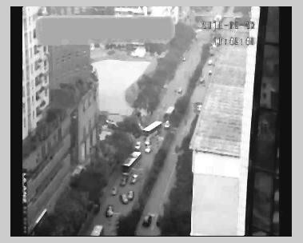

### 图像检测

运动目标的检测在视频处理中的目的是为了对其中的活动目标进行识别与追踪，进而分析其运动行为。为了实现此目的，背景差分法被广泛应用于图像检测任务中。其核心思想是通过将当前帧图像与背景图像做差，结合一个合适的阈值进行二值化，从而检测出场景中的运动目标。背景建模是背景差分法中的一个关键步骤。

常见的背景建模方法有直方图法、平均值法以及差异积累背景建模法等。直方图法在面对交通阻塞或缓慢移动的车辆时存在失效的情况，并且在存储上较为浪费。而平均值法在车辆流量较大时的效果较差，且同样会占用较多内存。鉴于这些原因，差异积累背景建模法成为了最适合的选择。

差异积累背景建模法的实现步骤如下：

1. 初始化与差异计算：

对于一个包含 N 帧的视频图像序列 $Ix,y,t$ ，设定第一帧图像 $Ix,y,t1$ 作为基准图像。对于第 k 帧图像，其与基准图像的差异 $Fx,y,tk$ 可表示为：

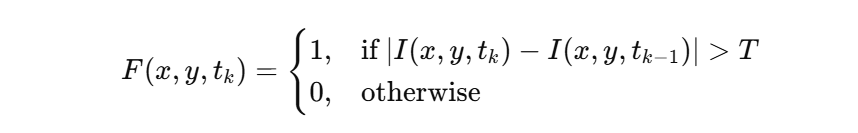

其中，T为设定的变化阈值，控制了何种程度的像素变化会被认为是运动目标。

2. 变化矩阵与背景更新：

记录像素变化的动态矩阵 $Dx,y,tk$ 的更新规则如下：

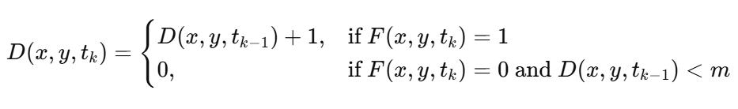

当 $Dx,y,tk=m$ 时，表明该像素点短时间内的灰度变化非常小，可以认为该位置属于背景，从而更新背景模型。背景模型 $Bx,y,tk$ 的更新公式为：

$Bx,y,tk=alphaIx,y,tk+1−alphaBx,y,tk−1$

为背景更新的平滑滤波因子，决定了更新的速度和灵敏度，通常选取在 $0.05,0.1$ 其内的值。

3. 背景模型更新与优化：

当像素点的变化积累矩阵 $Dx,y,tk$ 达到预设阈值m 时，可以认为该像素的位置在短期内不再发生明显的变化，从而将其视为背景，并对背景进行相应的更新。

通过差异积累背景建模法，能够有效地提取出视频中发生运动的目标，并将其与背景区分开来。该方法的优势在于对动态场景具有较好的适应能力，能够在变化的环境中保持较好的检测性能。

在背景建模完成后，进行运动前景的检测与处理。分别采用了Otsu算法与形态学滤波法进行分析，最终发现，形态学滤波方法效果最佳。态学处理的核心思想是利用具有特定形状的结构元素来测量和提取图像中的相应形态，从而实现图像的分析和识别。在本案例中，采用了形态学滤波中的开操作，开操作主要作用于消除图像中的离散点和噪声，旨在对图像进行平滑处理。

### 图像的后处理

为为了更好地标志车辆在图像中的存在，后处理方法采用了边缘检测。通过此方法，不相关的信息被剔除，图像中重要的结构特征被保留下来。最常用的边缘检测算子，Canny算子，其处理步骤如下所示：

高斯滤波器对图像进行滤波，噪声在此过程中被去除，图像中的噪声成分得到有效抑制；

高斯算子的一阶微分对图像进行处理，梯度的强度和方向得以计算，图像的边缘特征被提取；

梯度图像通过非抑制和滞后阈值的处理，最终得到边缘图像，边缘信息完整地呈现出来。最终的边缘检测图像，见下图。

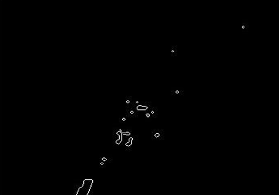

### 数据处理

在对两个视频进行图像处理后，忽略了前几秒显示不稳定的视频内容，开始了对视频一中每一分钟通过事故横断面及从上游路口涌现的大型、中型、小型机动车以及电瓶车数量和排队长度的计算。选择一分钟作为计算周期的原因在于，附件五中显示上游路口的信号周期为60秒。若选取30秒，视频中上游路口的车辆数量会出现周期性波动，导致分析数据出现上升与下降的不规律变化，进而不利于数据的准确分析。

为了简化模型，在视频中对车辆进行了大中小三类的分类。鉴于小轿车是该交通路段的主要交通工具，因此其被视为标准车当量。而中型车（如小型客货车等）的标准车当量设定为1.5，大型车（如公交车等）的标准车当量则设定为2。最终，对视频中事故持续时间和排队长度进行了统计，得到了每一分钟通过事故横断面以及从上游路口涌现的各类车辆数量，详细数据见附录。

然而，由于视频中出现了卡顿、暂停、跳变以及镜头拉伸等现象，这些问题导致图像处理后的结果不稳定，必须对这些不稳定的视频信息进行剔除，确保数据的有效性和准确性。

# 问题一模型

### 问题分析及模型选取

视频中，交通事故发生至撤离期间，原本顺畅的三车道，转瞬间变成了拥堵的单车道。此时，横断面的通行能力遭受了极大限制，理论通行能力迅速下降，实际通行能力因此受到显著影响，导致交通堵塞的风险大大增加。

为了精确估算车道被占用时对城市道路通行能力的影响程度，且为交通管理部门在引导车辆行驶时提供科学依据，必须建立一个能够反映事故期间事故所处横断面实际通行能力随时间变化的序列模型。此外，还需进一步分析实际通行能力与理论通行能力其内的关系

### 理论通行能力的计算

结合实际道路和交通情况计算理论通行能力，通过引入一系列修正系数来得出的。这些修正系数考虑了道路、交通和环境等多种因素对通行能力的影响，最终通过修正系数与基本通行能力的乘积，得到特定条件下的理论通行能力。

基本通行能力 $Nmax$ 是在标准条件下的最大通行能力，参考文献[2]给出的该值为 2000 pcu/h。修正系数则包括以下几个方面：

沿途修正系数 $γ5$ ：考虑了道路沿途条件对通行能力的影响，取值为 0.7。

车宽修正系数 $γ1$ ：此系数考虑了车道宽度对通行能力的影响，取值为 0.94。

侧空修正系数 $γ2$ ：考虑了道路两侧净空距离的影响，取值为 1。

不同车型的交通条件修正系数 $γ6$ ：该系数根据大车占流量的比例 H 进行计算，反映了不同车型对交通流的影响。

纵坡度修正系数 $γ3$ ：考虑了道路纵坡度对通行能力的影响，取值为 1。

视距修正系数 $γ4$ ：考虑了视距不足对通行能力的影响，值为 1。

交通条件修正系数的计算公式：

$γ6=100−H+2H100$

最终理论通行能力的计算：

结合上述修正系数，理论通行能力 $Ntk$ 可以表示为：

$Ntk=Nmax×γ1×γ2×γ3×γ4×γ5×γ6$

根据这些修正系数，计算得到的实际理论通行能力约为 $ 1315 pcu/h。$

计算过程：

1. 基本通行能力： $Nmax=2000pcu/h。$

2. 修正系数：

假设 $ H = 0.2 $ （大车占流量的比例为 20%），则：

$γ6=100−0.2×100+2×0.2×100100=100−20+40100=1.2$

3. 最终理论通行能力：

$Ntk=2000×0.94×1×1×1×0.7×1.2=1315 pcu/h$

通过引入多个修正系数，理论通行能力能够更精确地反映出实际道路和交通条件下的通行情况。根据不同修正系数的影响，最终得到的理论通行能力为 1315 pcu/h。

# 问题二模型

### 问题分析及模型选取

观察视频中的横断面实际通行能力、理论通行能力及事故持续时间变化图像时，不难发现，实际通行能力围绕理论通行能力发生了显著的波动。若对视频一与视频二中发生交通事故的车道进行仔细分析（参见附件三），则得出以下结论：视频一中的事故占用了车道二和车道三，而视频二中的事故则占用了车道一和车道二。根据常识推理，当一辆车驶入事故发生的路段时，若其需要右转，通常会选择车道一；若直行，则偏向车道二；而左转的车辆则进入车道三。参考附件三中的交通流数据，右转流量占比为21%，直行流量占比为44%，左转流量占比为35%。由此可见，三条车道的实际通行能力其内存在显著差异。不同车道的占用，将对横断面的实际通行能力产生不同程度的影响。

要深入分析这种影响差异，构建一个模型评估不同车道被占用时交通事故对同一横断面通行能力的影响显得尤为重要。为此，首先需分析视频一与视频二中交通事故占用不同车道对横断面实际通行能力所造成的显著性差异。常用的分析方法是方差分析，然而方差分析要求进行正态性检验与方差齐性检验。若这两项检验未能通过，则必须使用非参数检验方法来进一步分析。

为进一步探讨交通事故占用不同车道对通行能力的影响，可以通过研究车道流量与横断面实际通行能力其内的关系来进行分析。考虑到车道其内可能存在相互作用，本研究采用了通径分析方法，以准确描述车道流量与横断面实际通行能力其内的关系。

通过此类分析，我们能够更全面地了解交通事故占用不同车道对通行能力的具体影响，为今后类似情况下的预判和应对提供更为扎实的理论依据。

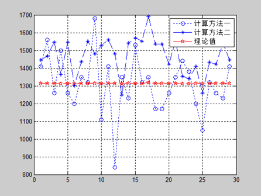

### 模型建立及求解

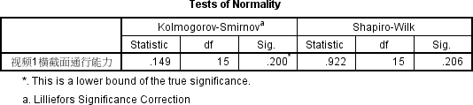

首先，视频一横断面实际通行能力通过SPSS进行了正态性检验。所使用的实际通行能力数据，来源于计算方法（8）。根据正态性检验：

图 9

可知 sig>0.05，说明视频一横断面实际通行能力符合正态性。

接着对视频二横断面实际通行能力进行正态性检验，其计算方法同式(8)，检验的结果如下：

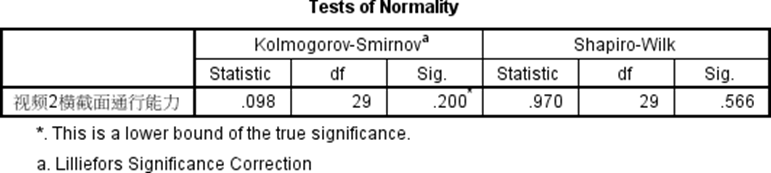

可见，sig > 0.05，这表明视频一横断面的实际通行能力符合正态分布的假设。接着，视频二横断面的实际通行能力也进行了正态性检验。

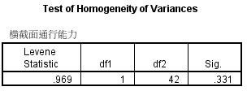

同样地，sig > 0.05，意味着视频二的横断面实际通行能力也符合正态性。由此可得出结论，视频一与视频二的横断面实际通行能力都服从正态分布。接下来，我们进行了方差齐性检验，使用SPSS得出的检验结果如下：

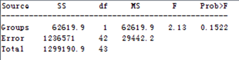

根据图11，sig > 0.05，因此通过了齐次性检验。于是，便可直接通过方差分析判断两者其内是否存在显著性差异。使用Matlab所得到的结果如下所示：‘

对于该结果的解释，可以提出两种可能性：一方面，可能是由于通道一与通道三的流量比例相差不大，且事故均占用了通道二，导致实际通行能力的差异微乎其微；另一方面，当仅剩一道车道时，所有车辆都无法根据转向需求选择车道，因此被占用的车道无论是哪一条，都不会产生显著的影响。为进一步验证这两种假设，必须进行更深入的探讨。

接下来，我们使用SPSS进行了通径分析，结果如下所示：
为了更深入地理解交通事故在同一横断面上占用不同车道对通行能力的具体影响，通径分析无疑成为了关键的分析工具。通径分析作为相关分析的扩展，在多元回归的基础上，借助对相关系数的分解，计算了直接通径、间接通径及总通径系数。这些系数能够反映各自变量对因变量的直接影响、通过其他自变量的间接作用以及二者综合效应的作用大小。

通径分析的步骤如下：

1. 建立回归模型：

设定各个车道在一分钟内的交通量作为自变量 $Xii=1,2,3$ ，其计算公式为：

`Xi=Nuηi`

Nu 表示上游一分钟的总交通量，由于交叉路口 1 和 2 的交通量较少，通常可以忽略不计。而 $ηi$ 表示第 i 个车道的流量比例。横断面的通行能力为因变量 Y，此时自变量 $Xi$ 取其平均值。然后，通过一般的多元线性回归分析，得到以下方程：

`Y=β0+β1X1+β2X2+β3X3#`

其中，Y 为因变量的平均值， $X1,X2,X3$ 为各个车道的流量平均值。

2. 计算差值回归模型：

接下来，进行差值计算，将上面的回归方程 (12) 变为：

`Y−Y=β1X1−X1+β2X2−X2+β3X3−X3#`

在这里， $Y,X1,X2,$ 和 $X3$ 代表各个变量的平均值。

3. 标准化：

对式 (14) 两边同时除以 Y 的标准差 $σY$ ，得到标准化后的回归模型：

`Y−YσY=β1X1−X1σX1+β2X2−X2σX2+β3X3−X3σX3#`

在这里， `σY和σX1,σX2,σX3` 分别为 Y 和各个 $Xi$ 的标准差。

4. 最小二乘法求解：

利用最小二乘法来求解式 (15) 中各个自变量的线性回归系数。通过这些系数，我们可以进一步对简单相关系数进行分解，得到通径分析的基本方程：

其中， $rij$ 表示自变量 $Xi$ 与 $Xj$ 其内的简单相关系数， $riY$ 表示自变量 $Xi$ 与因变量 Y 其内的简单相关系数， $PiY$ 是直接通径系数，它表示自变量 $Xi$ 对因变量 Y 的标准化偏相关系数，反映了自变量 $Xi$ 对因变量的直接影响效果。

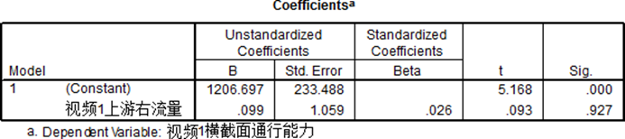

上游右转流量对横断面实际通行能力具有显著的促进作用。这一现象的原因在于，视频一中的交通事故所占用的车道是车道二和车道三，因此，右转车道的影响被最小化。由此，增加上游路口的右转流量有助于提高横断面的实际道路通行能力。

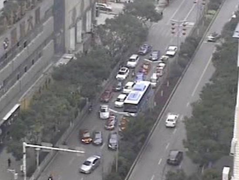

该横断面实际通行能力的影响，主要取决于各通道流量的比例。当流量比例相差不大时，无论哪个车道被占，横断面的实际通行能力变化都较为接近；而当流量比例差异较大时，若被占用的是流量较大的车道，则横断面的实际通行能力下降较为显著；相反，若被占用的是流量较小的车道，实际通行能力的下降则相对较小

# 问题三模型

### 问题分析及模型选取

显而易见，根据题意，分析视频一中的交通事故所引起的路段车辆排队长度与事故横断面实际通行能力、事故持续时间及路段上游车流量其内的关系，实际上是为了构建一个针对拥堵交通流的排队长度模型。此模型分析涉及到多方面的理论，如概率论、排队论、随机过程、累计曲线、冲击波、神经网络及微观模拟等。由于车辆排队长度与事故横断面实际通行能力、事故持续时间、路段上游车流量其内的关系极为复杂，因此，优先考虑使用神经网络模型来求解这种非线性关系。

以事故横断面实际通行能力、事故持续时间及路段上游车流量作为输入样本，并将车辆排队长度作为输出样本，进而对反向传播神经网络进行训练和优化。

然而，排队长度通过视频的直接测量并非易事。若通过简单的线性比例尺来估算，则由于视角问题，所带来的误差往往较大。因此，在此提出两种替代方案：一是采用Herman等人在1979年与1984年提出的基于多车道交通的动力学理论—即城市交通二流理论（详见参考文献[3]）；二是通过使用非线性比例尺来进行计算，并进一步对两种方法进行比较，最终决定采用哪一种计算方法。

城市交通二流理论将车辆分为“运动车辆”和“停止车辆”两类。前者形成的交通流被称为“行驶交通流”，后者形成的交通流则称为“阻塞交通流”。如图16所示，过渡状态B的不均匀交通流被视为由A部分的均匀阻塞交通流和C部分的均匀行驶交通流的加权和构成，即流中仅包含这两种均匀交通流。将交通流B的实际运行状态视为二流运行状态。转化过程中，受到排队和减速影响的交通流B与交通流A的排队长度相等效，合并为等效的当量排队长度 $LA'$ ，即在二流运行状态中，阻塞交通流的长度。

### 排队长度的计算

- 基于二流理论的排队长度计算

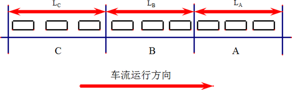

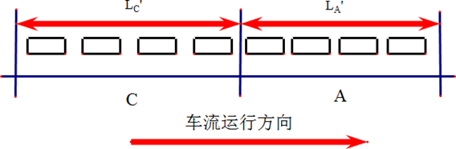

在多车道路段的单入口单出口模型中，当某一车道的排队长度明显大于其他车道时，驾驶员通常会选择换道，以分散排队压力。这一换道现象促使各车道其内的排队长度逐渐趋于平衡，从而使得整体路段的当量排队长度可以通过各车道排队长度的平均值来表征。

根据交通流理论，流量与密度其内的关系呈现出二次抛物线型。在该关系图中，当密度达到最优值时，流量也达到最大值。因此，交通流状态可分为两大类：非拥堵状态与拥堵状态。在这两种状态其内，存在一个临界点，标志着流量的临界状态，这一状态通常被视为从非拥堵到拥堵的过渡点，并且是行驶交通流的标准。

根据流量守恒定理，单入口单出口的三车道路段可以通过以下关系式来描述：

`S0+i=13SUi,t=i=13SDi,t+ΔSt`

其中， $S0$ 表示初始时刻 t=0 上游与下游断面其内的车辆数； $i=13SUi,t$ 是时刻 t 通过上游断面的车辆累计数； $i=13SDi,t$ 是时刻 t 通过下游断面的车辆累计数； $ΔSt$ 则表示时刻 t 上下游断面其内的车辆数。上游断面即为事故所占车道所在的横断面，下游断面是指视频中最长排队长度的最后一辆车所处的位置，通常距上游路口 120 米，亦即距离事故发生地点 120 米的位置。

根据二流理论， $ΔSt$ 可以通过下式计算：

`ΔSt=kjLDt+kmL−LDt#`

其中，L 是上下游断面其内的距离，也可以理解为平均当量排队长度 $LDt$ 的最大值，因此 $LDt$ 不应超过 L，此处取最大排队长度为 120 米； $km$ 表示上下游断面其内的平均单车道最佳密度，依据格林伯模型，该值为 $59 pcu/km$ ；而 $kj$ 为上下游断面其内的平均单车道阻塞密度，查阅资料可知此值为 160 pcu/km。

结合式(17)和式(18)，可以推导出如下的多车道当量排队长度模型：

`LDt=S0+i=13SUi,t−i=13SDi,t−3kmL3kj−km`

此式表明，基于二流理论的多车道当量排队长度模型，可以通过上游与下游断面其内的交通流密度以及其它相关参数来计算排队长度。此处，k(t) 表示时刻 t 上下游断面其内的平均单车道交通流密度，且满足：

`kt=S0+i=13SUi,t−i=13SDi,t#`

通过进一步分析，可以得到交通流状态的不同：

- 非拥挤状态： 当 $0≤kt<km$ 时，上下游断面其内的交通流处于非拥挤状态；

- 最佳流量状态： 当 $kt=km$ 时，上下游断面其内的交通流处于最佳行驶状态，流量最大；

- 拥挤状态： 当 $km<kt≤kj$ 时，上下游断面其内的交通流处于拥挤状态。

当 `S0+i=13SUi,t−i=13SDi,t=3kmL时，LDt=0` ，此时当量排队长度取得最小值，表示交通流达到最佳密度，上下游其内不再有排队，交通流进入最佳状态，这是式(19)的边界条件。：

为了进一步分析排队长度随时间变化的情况， `i=13SUi,t和i=13SDi,t` 需要通过以下公式计算：

`i=13SUi,t=i=13SUi,t−T+QUt`

`i=13SDi,t=i=13SDi,t−T+QDt`

$QUt$ 和 $QDt$ 分别表示上游和下游断面在时间段 T（本文中取 T = 10 秒）内通过的车辆数。

因此，通过计算初始时刻 t=0 时上、下游断面其内的车辆数 $S0$ ，并计算每个 10 秒时间段内通过上游和下游断面的车辆数 $QUt$ 和 $QDt$ ，可以逐步得到每隔 10 秒时的排队长度变化。最终，通过式(19)可以计算出排队长度随时间变化的图像。

这种方法有效地结合了交通流理论与二流模型的分析，帮助更精确地预测和分析交通事故发生时，特别是在多车道交通流中，车辆排队长度和交通流状态的变化。

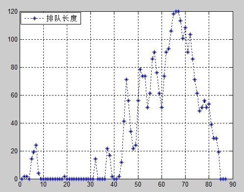

### 基于非线性比例尺的排队长度计算改进

由于线性比例尺在视频中应用时存在显著的测量误差，若使用该方法计算排队长度将带来严峻的偏差。如右图所示，尽管AG等于BG，但在D点的视角下，由于视频为平面图像，CE与EF之间的长度不等。因而，无法直接采用线性比例尺进行准确测量。因此，非线性比例尺被引入以解决这一问题。

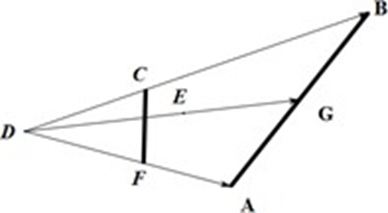

在视频的拍摄过程中，由于路段接近下游路口时较近于摄像机，比例较小；而接近上游路口时，因路段离摄像机较远，比例则相对较大。由此可见，比例随道路距离上游路口的接近程度而增大。因此，考虑到这一非线性关系，提出两种模型进行模拟。一种是幂函数模型，即实际长度 $y$ 与视频图像长度 $x$ 满足关系式 $y=Cx^{\alpha}$ ；另一种为指数模型，即实际长度 $y$ 与视频图像长度 $x$ 满足关系式 $y=Ce^{ax}$ 。

将这两种非线性比例尺计算得到的排队长度与二流理论计算的结果进行对比，发现二流理论在事故发生前期与后期的排队长度预测误差较大。因此，作为训练样本时，优先采用通过非线性比例尺得出的排队长度值。为了简化计算，采用图像处理后的排队长度测量方法，此方法具有更高的对比度，优化了测量效果，结果如下所示：

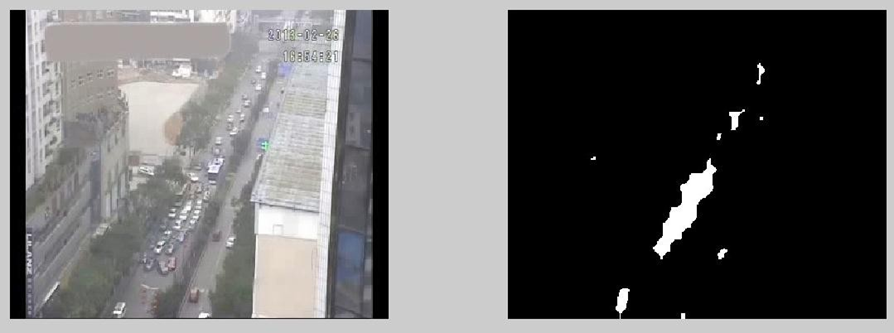

### 影响排队长度因素的神经网络模型求解

接接下来，采用反向传播神经网络进行训练。反向传播神经网络（反向传播网络）模拟了大脑神经元并行工作过程，能够通过反馈预测结果与实际结果的差值，不断优化预测值的准确度。网络由输入层、隐含层和输出层构成。层内的神经元之间没有直接连接，但每个神经元与后续层的所有神经元都保持连接，连接通过带权重的网络传递，权重表示神经元连接的强度。输入层接收到学习样本后，信号经过隐含层的处理，最终在输出层生成预测值。输出值与实际值进行比较后，误差反向传递至隐含层，修正权值，从而提升网络的预测能力。此过程的核心依据是“负梯度下降”法则

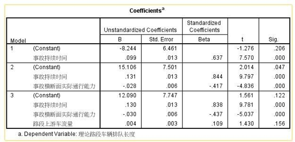

通过通径分析可知，事故持续时间对排队长度的影响远大于事故横断面实际通行能力和路段上游车流量的影响。因此，为简化分析并提升计算效率，可以将事故持续时间与上游车流量两个自变量统一处理，采用客观赋权法进行权重分配。最终，反向传播神经网络模型的输入层将包含两个输入节点，输出层为一个节点。

夹角余弦法步骤：

1. 构建指标矩阵：

首先，将两种自变量（事故持续时间与上游车流量）构成一个指标矩阵 J 。

2. 确定最佳与最劣方案：

依据指标矩阵，求出最佳方案 $U1=10.5,1$ 和最劣方案 $U2=0,11$ 。

3. 计算效益型矩阵和相对偏差矩阵：

根据夹角余弦法的公式，我们可以分别计算效益型矩阵 $Ri,j$ 和相对偏差矩阵 $δi,j$ ：

$Ri,j=\max{Ji,j}−\min{Ji,j}$

$δi,j=1−Ri,j$

4. 计算各项的权重：

进一步通过公式计算出每项的权重：

`ci=j=1nRi,j×δi,j#`

然后，得到各项的相对权重：

`ωfi=cii=1nci#`

经过上述计算，我们得到了权重向量 $ωf=0.395,0.605$ 。这一结果表明，路段上游车流量对整体影响的权重为 0.395，事故横断面实际通行能力的权重为 0.605。

建立神经网络模型：

在已明确各项权重后，使用加权自变量（即路段上游车流量与事故横断面实际通行能力的综合权重）以及事故持续时间，作为 反向传播神经网络的输入样本。排队长度则作为网络的输出样本，进行训练。网络的隐含层层数设为三层。

在具体的训练过程中，将前述计算出的自变量数据与事故持续时间数据输入神经网络，通过训练得到一个经过优化的 反向传播神经网络模型。此模型能够基于已知的输入变量（如事故持续时间和上游车流量），预测排队长度的变化趋势。

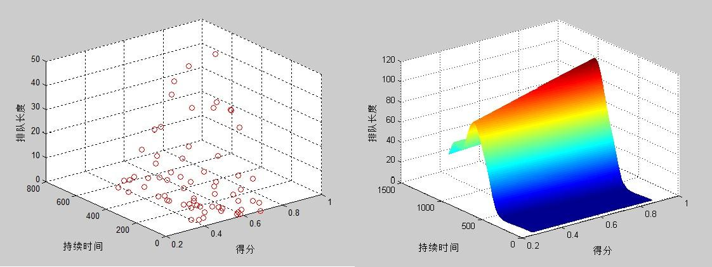

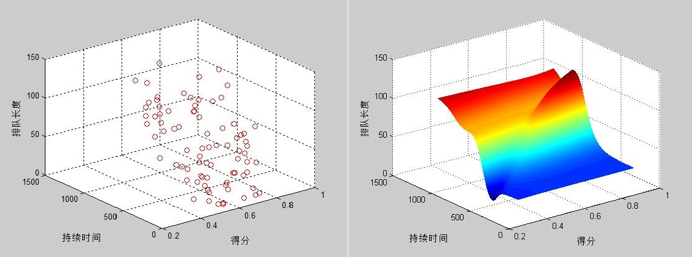

通过与样本数据对比，可以看出，神经网络模拟结果大致符合样本的变化趋势。具体来说，事故持续时间越长，排队长度越大；而当上游车流量增加时，事故横断面通行能力下降，排队长度也随之增长，这些结果符合常识。然而，在模拟过程中，出现了不同程度的波动，这种波动性主要由样本本身的波动所导致。根本原因在于，基础的 反向传播神经网络收敛速度较慢，且容易陷入局部最优解。因此，有必要对传统的 反向传播神经网络模型进行改进，以提升其表现。

### 基于遗传算法的神经网络模型改进

遗传算法是由Holland教授于1962年提出的，并通过模拟生物进化过程中的“优胜劣汰”机制进行优化。其基本思想是将生物界的进化原理引入优化参数的编码串中，通过选择、交叉和变异等遗传操作，筛选出适应度更高的个体，使其继承优良特征，而适应度较差的个体被淘汰。不断迭代，直到满足优化目标为止。其基本步骤如下

遗传算法优化 反向传播神经网络的过程分为三个部分：反向传播神经网络结构确定、遗传算法优化和 反向传播神经网络预测

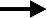

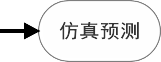

如图所示，遗传算法通过优化 反向传播神经网络的权值和阈值进行调优。种群中的每个个体包含网络所有权值和阈值，通过适应度函数计算出个体适应度值，遗传算法通过选择、交叉和变异操作找到最优适应度值对应的个体。优化后的权值和阈值被赋予 反向传播神经网络，并经过训练后预测输出。

经过多次试验，遗传算法的参数最终确定为：进化次数为11次，交叉概率为0.4，变异概率为0.2，样本量为81，反向传播神经网络的其他参数同上。最终仿真预测结果如图 27 所示：

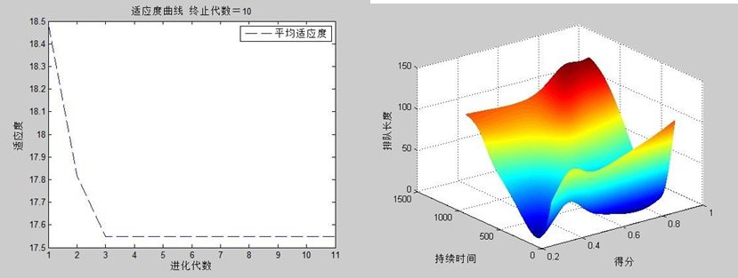

将该结果与图 25 左图及图 21 的非线性比例尺计算得到的样本进行比较，发现样本拟合效果优良，尤其是在初始状态的变动等信息得到了有效保留。仿真结果表明，排队长度随着事故持续时间的延长、横断面实际通行能力的下降、以及路段上游车流量的增加而呈现增长趋势。

# 模型评价和改进

根据查阅的相关文献，通行能力可被区分为理论通行能力与实际通行能力。对实际通行能力的计算，依据给定公式进行。通过分析实际通行能力的变动发现，随时间变化其值不断波动。在对这种变动进行正态性检验时，结果显示其符合正态分布。进而，当实际通行能力与理论通行能力进行对比时，观察到实际通行能力围绕理论通行能力上下波动。由此可推断，实际通行能力受限于理论通行能力，但其波动则受到现实条件的影响。然而，值得注意的是，此模型未进一步探索现实条件对实际通行能力的具体影响。

对视频一和视频二中的实际通行能力，经过正态性检验和方差齐次检验后，进行方差分析。结果显示，两者之间并未呈现显著性差异。为了深入分析同一横断面上，交通事故所占车道的不同对通行能力的影响，进一步对视频一与视频二的实际通行能力进行通径分析。此分析得出结论：同一横断面交通事故所占车道的不同对实际通行能力的影响，主要取决于各车道的流量比例。此模型不仅清晰易懂，且便于操作，具备良好的推广性。

通过应用城市交通二流理论，预测了不同时间点的排队长度。然而，结果显示该理论受边界条件的影响较大，因此在部分时段与实际情况存在偏差。为此，采用非线性比例尺对视频一中不同时间点的排队长度进行了统计分析，并使用夹角余弦法将因变量的数量降至两个。随后，利用反向传播神经网络进行训练与仿真预测，发现模型的预测效果并不理想。为了提升仿真效果，使用遗传算法对神经网络结构进行了优化，从而克服了局部最优解的问题。尽管如此，计算排队长度时，误差依旧存在，表明对于视频中的各个时间点排队长度，仍需采用更为精确的计算方法。

应用离散动力学系统模型——元胞自动机，该模型具备强大的仿真能力，能够较为准确地模拟城市交通流中的相关规则。通过仿真结果发现，排队长度在不到10分钟的时间内便到达了上游路口。随后，进一步考虑红绿灯对交通流的影响，调整了元胞更新规则，并进行新的仿真模拟。结果表明，排队长度的波动幅度有所增加，并且排队长度到达上游路口的时间总体上明显缩短。

# 参考资料

王建军,《路网环境下高速公路交通事故影响传播分析与控制》,北京:科学出版社,2010

交调管理员, 《道路路段通行能力分析》, http://www.sdjd.net/Article/zhishi/200411/82.html, 2013/9/14

韩延玲, 《智能交通系统中视频车辆检测与定位技术研究》, http://d.g.wanfangdata.com.cn/Thesis_Y1909086.aspx, 2013/9/13

Bastien Chopard, M. D.,《物理系统的元胞自动机模拟》,北京:清华大学出版社,2003

Matlab 中文论坛,《Matlab 神经网络 30 个案例分析》,北京:北京航空航天大学出版社出版发行,2010

杜家菊等,《使用 SPSS 线性回归实现通径分析的方法》,生物学通报,2010,45(2):4-6,2010

张维，袁绍欣，陶建军，等. 基于多元因素的Bi-LSTM高速公路交通流预测[J]. 计算机系统应用，2021, (6). DOI: 10.15888/j.cnki.csa.007969。

冒云香，李星毅. 随机森林在短时交通流中的应用[J]. 计算机与数字工程，2020, (7). DOI: 10.3969/j.issn.1672-9722.2020.07.009。

闫旭，范晓亮，郑传潘，等. 基于图卷积神经网络的城市交通态势预测算法[J]. 浙江大学学报（工学版）, 2020, (6). DOI: 10.3785/j.issn.1008-973X.2020.06.011。

郑楠，杨文臣，马力，等. 突发交通事件对山区高速公路交通运行影响的VISSIM仿真分析及预测[J]. 安全与环境工程，2020, (4). DOI: 10.13578/j.cnki.issn.1671-1556.2020.04.030。

马庚华，郑长江，付文进，等. 突发事件下城市交通影响范围研究[J]. 武汉理工大学学报（交通科学与工程版）, 2019, (4). DOI: 10.3963/j.issn.2095-3844.2019.04.011。

# 附件

问题一视频一获取的数据

| 时间 | 小型车 | 中型车 | 大型车 |   |   |   |
| --- | --- | --- | --- | --- | --- | --- |
| 16:38:30 | 5 | 1 | 1 |   |   |   |
| 16:39:30 | 8 | 1 | 1 |   |   |   |
| 16:40:30 | 16 | 1 | 1 |   |   |   |
| 16:41:30 | 17 | 3 | 1 |   |   |   |
| 事故发生时横断面 |   |   |   |   |   |   |
| 时间 | 通过横截面的车 |   | 上游路口过来的车 |   |   |   |
|   | 小型车 | 中型车 | 大型车 | 小型车 | 中型车 | 大型车 |
| 16:42:30 | 16 | 2 | 4 | 9 | 0 | 3 |
| 16:43:30 | 18 | 1 | 1 | 13 | 0 | 0 |
| 16:44:30 | 16 | 1 | 0 | 14 | 1 | 1 |
| 16:45:30 | 19 | 0 | 1 | 10 | 1 | 0 |
| 16:46:30 | 14 | 3 | 0 | 19 | 0 | 1 |
| 16:47:30 | 17 | 2 | 1 | 13 | 3 | 0 |
| 16:48:30 | 20 | 3 | 0 | 18 | 1 | 1 |
| 16:49:30 | 7 | 1 | 0 | 0 |   | 0 |
| 16:50:00 | 14 | 2 | 1 | 16 | 2 | 0 |
| 16:51:00 | 18 | 4 | 0 | 19 | 3 | 0 |
| 16:52:00 | 12 | 2 | 1 | 16 | 0 | 1 |
| 16:53:00 | 13 | 2 | 1 | 16 | 2 | 2 |
| 16:54:00 | 15 | 2 | 1 | 13 | 1 | 0 |
| 16:55:00 | 13 | 3 | 0 | 12 | 1 | 0 |
| 16:58:00 | 14 | 2 | 0 | 11 | 1 | 1 |
| 16:59:00 | 14 | 3 | 2 | 10 | 1 | 1 |
| 17:00:00 |   |   |   |   |   |   |
| 17:01:00 | 事故结束 |   |   |   |   |   |
| 时间 | 小型车 | 大型车 |   |   |   |   |
| 17:02:00 | 42 | 4 |   |   |   |   |

计算方法二得到的实际通行能力

| 时间点   （min） | 1 | 2 | 3 | 4 | 5 | 6 | 7 | 8 |
| --- | --- | --- | --- | --- | --- | --- | --- | --- |
| 实际通行能力 (pcu/h | 1108.1 | 1314.2 | 1436.4 | 1311.5 | 1436.4 | 1316.7 | 1436.4 | 1299.6 |
| 时间点   （min） | 9 | 10 | 11 | 12 | 13 | 14 | 15 |   |

| 实际通行能力 (pcu/h | 1436.4 | 1285.2 | 1292.8 | 1305.8 | 1436.4 | 1436.4 | 1219.6 |   |
| --- | --- | --- | --- | --- | --- | --- | --- | --- |

问题二视频二获取的数据

|   |   |   | 横截面 |   |   | 上游路口 |
| --- | --- | --- | --- | --- | --- | --- |
| 时间 | 小型车 | 中型车 | 大型车 | 小型车 | 中型车 | 大型车 |
| 17:29:00 | 16 | 2 | 0 | 12 | 1 | 0 |
| 17:30:00 | 23 | 0 | 1 | 17 | 0 | 1 |
| 事故发生 |   |   |   |   |   |   |
| 17:34:17 | 18 | 1 | 2 | 16 | 1 | 3 |
| 17:35:17 | 19 | 2 | 2 | 12 | 2 | 1 |
| 17:36:17 | 16 | 2 | 1 | 18 | 0 | 1 |
| 17:37:17 | 16 | 2 | 3 | 11 | 0 | 3 |
| 17:38:17 | 19 | 0 | 1 | 12 | 0 | 2 |
| 17:39:17 | 14 | 0 | 3 | 19 | 0 | 3 |
| 17:40:17 | 17 | 1 | 2 | 13 | 1 | 2 |
| 17:41:17 | 20 | 0 | 1 | 11 | 0 | 2 |
| 17:42:17 | 21 | 2 | 2 | 13 | 1 | 1 |
| 17:43:17 | 15 | 1 | 1 | 15 | 0 | 1 |
| 17:44:17 | 20 | 1 | 1 | 15 | 1 | 1 |
| 17:45:17 | 12 | 0 | 1 | 10 | 1 | 2 |
| 17:46:17 | 13 | 1 | 4 | 10 | 1 | 2 |
| 17:47:17 | 17 | 1 | 1 | 17 | 1 | 1 |
| 17:48:17 | 22 | 1 | 1 | 19 | 0 | 1 |
| 17:49:17 | 17 | 2 | 1 | 23 | 1 | 1 |
| 17:50:17 | 18 | 3 | 0 | 23 | 1 | 1 |
| 17:51:17 | 16 | 1 | 1 | 13 | 0 | 1 |
| 17:52:17 | 16 | 1 | 1 | 11 | 0 | 2 |
| 17:53:17 | 17 | 0 | 2 | 19 | 1 | 1 |
| 17:54:17 | 19 | 1 | 1 | 7 | 0 | 2 |
| 17:55:17 | 15 | 2 | 3 | 11 | 0 | 4 |
| 17:56:17 | 17 | 0 | 3 | 15 | 0 | 2 |
| 17:57:17 | 16 | 0 | 2 | 12 | 1 | 5 |
| 17:58:17 | 10 | 1 | 3 | 22 | 0 | 1 |
| 17:59:17 | 15 | 2 | 2 | 17 | 0 | 2 |
| 18:00:17 | 17 | 0 | 2 | 15 | 0 | 2 |
| 18:01:17 | 17 | 1 | 1 | 17 | 1 | 1 |
| 18:02:17 | 18 | 1 | 2 | 10 | 0 | 2 |
| 18:03:28 |   |   |   |   |   |   |

问题二两个视频各个车道的流量

| 视频1横截面通行能力 | 上游流量 | 上游左流量 | 上游中流量 | 上游右流量 |
| --- | --- | --- | --- | --- |
| 1620 | 900 | 315 | 396 | 189 |
| 1290 | 780 | 273 | 343.2 | 163.8 |
| 1050 | 1050 | 367.5 | 462 | 220.5 |
| 1260 | 690 | 241.5 | 303.6 | 144.9 |
| 1110 | 1260 | 441 | 554.4 | 264.6 |
| 1320 | 1050 | 367.5 | 462 | 220.5 |
| 1470 | 1290 | 451.5 | 567.6 | 270.9 |
| 1140 | 1140 | 399 | 501.6 | 239.4 |
| 1440 | 1410 | 493.5 | 620.4 | 296.1 |
| 1020 | 1080 | 378 | 475.2 | 226.8 |
| 1080 | 1380 | 483 | 607.2 | 289.8 |
| 1200 | 870 | 304.5 | 382.8 | 182.7 |
| 1050 | 810 | 283.5 | 356.4 | 170.1 |
| 1020 | 870 | 304.5 | 382.8 | 182.7 |
| 1350 | 810 | 283.5 | 356.4 | 170.1 |

| 视频2横截面通行能力 | 上游流量 | 上游左流量 | 上游中流量 | 上游右流量 |
| --- | --- | --- | --- | --- |
| 1410 | 1410 | 493.5 | 620.4 | 296.1 |
| 1560 | 1020 | 357 | 448.8 | 214.2 |
| 1260 | 1200 | 420 | 528 | 252 |
| 1500 | 1020 | 357 | 448.8 | 214.2 |
| 1260 | 960 | 336 | 422.4 | 201.6 |
| 1200 | 1500 | 525 | 660 | 315 |
| 1350 | 1110 | 388.5 | 488.4 | 233.1 |
| 1320 | 900 | 315 | 396 | 189 |
| 1680 | 990 | 346.5 | 435.6 | 207.9 |
| 1110 | 1020 | 357 | 448.8 | 214.2 |
| 1410 | 1110 | 388.5 | 488.4 | 233.1 |
| 840 | 930 | 325.5 | 409.2 | 195.3 |
| 1350 | 930 | 325.5 | 409.2 | 195.3 |
| 1230 | 1230 | 430.5 | 541.2 | 258.3 |
| 1530 | 1260 | 441 | 554.4 | 264.6 |
| 1320 | 1590 | 556.5 | 699.6 | 333.9 |
| 1350 | 1590 | 556.5 | 699.6 | 333.9 |
| 1170 | 900 | 315 | 396 | 189 |
| 1170 | 900 | 315 | 396 | 189 |
| 1260 | 1350 | 472.5 | 594 | 283.5 |
| 1350 | 660 | 231 | 290.4 | 138.6 |
| 1440 | 1140 | 399 | 501.6 | 239.4 |
| 1380 | 1140 | 399 | 501.6 | 239.4 |
| 1200 | 1410 | 493.5 | 620.4 | 296.1 |
| 1050 | 1440 | 504 | 633.6 | 302.4 |
| 1320 | 1260 | 441 | 554.4 | 264.6 |
| 1260 | 1140 | 399 | 501.6 | 239.4 |
| 1230 | 1230 | 430.5 | 541.2 | 258.3 |
| 1410 | 840 | 294 | 369.6 | 176.4 |

问题三视频一的部分数据

|   | 横截面 | 中间 | 叉路 |   |   |   |   |   |   |
| --- | --- | --- | --- | --- | --- | --- | --- | --- | --- |
| 时间 | 小型车 | 中型车 | 大型车 | 小型车 | 中型车 | 大型车 | 小型车 | 中型车 | 大型车 |
| 16:43:50 | 2 | 1 |   | 0 |   |   | 0 |   |   |
| 16:44:00 | 3 |   | 1 | 1 |   |   | 0 |   |   |
| 16:44:10 | 3 |   |   | 2 |   |   | 0 |   |   |
| 16:44:20 | 2 |   |   | 5 |   |   | 0 |   |   |
| 16:44:30 | 2 |   |   | 1 |   |   | 0 |   |   |
| 16:44:40 | 4 |   |   | 2 |   |   | 0 |   |   |
| 16:44:50 | 3 |   |   | 1 |   |   |   | 1 |   |
| 16:45:00 |   | 1 |   | 3 |   |   | 0 |   |   |
| 16:45:10 | 3 |   |   | 2 |   |   | 0 |   |   |
| 16:45:20 | 1 | 1 |   | 7 |   |   | 0 |   |   |
| 16:45:30 | 2 | 1 |   | 4 |   | 1 | 1 |   |   |
| 16:45:40 | 3 |   |   | 1 |   |   | 0 |   |   |
| 16:45:50 | 3 |   |   | 0 |   |   | 0 |   |   |
| 16:46:00 | 1 |   | 1 | 0 |   |   | 1 |   |   |
| 16:46:10 | 2 |   |   | 3 | 1 |   | 0 |   |   |
| 16:46:20 | 3 |   |   | 3 |   |   | 1 |   |   |
| 16:46:30 | 3 | 1 |   | 3 |   |   | 0 |   |   |
| 16:46:40 | 3 |   |   | 0 |   |   | 0 |   |   |
| 16:46:50 | 2 |   |   | 0 |   |   | 0 |   |   |
| 16:47:00 | 2 |   |   | 2 |   |   | 1 |   |   |
| 16:47:10 | 3 |   |   | 2 |   |   | 0 |   |   |
| 16:47:20 | 1 |   |   | 5 |   |   | 0 |   |   |
| 16:47:30 | 3 |   |   | 4 | 1 | 1 | 0 |   |   |
| 16:47:40 | 2 |   |   | 4 |   |   | 2 |   |   |
| 16:47:50 | 2 |   | 1 | 1 |   |   | 0 |   |   |
| 16:48:00 | 4 |   |   | 1 |   |   | 0 |   |   |
| 16:48:10 | 3 |   |   | 5 |   |   | 1 |   |   |
| 16:48:20 | 3 |   |   | 3 |   |   | 0 |   |   |
| 16:48:30 | 4 |   |   | 7 | 1 |   | 0 |   |   |
| 16:48:40 | 3 |   |   | 1 |   |   | 1 |   |   |
| 16:48:50 | 3 |   |   | 0 |   |   | 0 |   |   |
| 16:49:00 | 1 | 2 |   | 0 |   |   | 1 |   |   |
| 16:49:10 | 3 |   |   | 3 |   |   | 0 |   |   |
| 16:49:20 | 3 |   |   | 5 |   |   | 1 |   |   |
| 16:50:10 | 3 |   |   | 3 |   |   | 2 |   |   |
| 16:50:20 | 3 |   |   | 9 |   |   | 0 |   |   |
| 16:50:30 | 3 |   |   | 6 | 2 |   | 0 |   |   |
| 16:50:40 | 3 |   |   | 0 |   |   | 0 |   |   |
| 16:50:50 | 3 | 1 |   | 0 |   |   | 0 |   |   |
| 16:51:00 | 4 |   |   | 0 |   |   |   | 1 |   |
| 16:51:10 | 2 | 1 |   | 3 |   |   | 1 |   |   |
| 16:51:20 | 1 | 1 |   | 7 |   | 1 | 0 |   |   |
| 16:51:30 | 3 | 1 |   | 9 |   |   | 0 |   |   |
| 16:51:40 | 1 | 1 |   | 0 | 1 |   | 0 |   |   |
| 16:51:50 | 3 |   |   | 3 |   |   | 0 |   |   |

### 问题一源程序

problem1.m problem1_2.m

### 问题二源程序

problem2.m ti2.m ti21.m ti2.sav ti2_1.sav ti2_2.sav

问题 2 结果.spv

### 问题三源程序

problem3.m problem3_2.m ti3.m

ti31.m ti3.sav

问题 3 结果.spv问题四源程序 problem4.m

注：m 文件是 Matlab 程序，sav、spv 是 SPSS 文件

课程论文成绩评定表

| 指标 | 评价内容 | 评价分值 | 得分 |   |   |   |
| --- | --- | --- | --- | --- | --- | --- |
| 选题 | 选题是否符合课程内容范围要求。 | 10-9 | 8-7 | 6-5 | 4-0 |   |
| 内容   论证 | 结构是否合理、严谨；思路是否清晰；逻辑是否严密；基本概念和基本原理是否正确；研究方法是否得当；模型及结论是否合理；论证是否充分。 | 50-45 | 44-40 | 39-30 | 29-0 |   |
| 规范 | 书写、格式、体例是否规范；文字表达是否准确、流畅；摘要是否精炼；是否符合学术道德规范。 | 20-18 | 17-16 | 15-12 | 11-0 |   |
| 软件 | 是否能熟练、独立运用软件分析和解决问题；是否有较强的科研能力。 | 10-9 | 8-7 | 6-5 | 4-0 |   |
| 文献 | 参考文献资料是否翔实；是否具有代表性。 | 10-9 | 8-7 | 6-5 | 4-0 |   |
| 原创性声明：   本人郑重声明：所呈交的课程论文，是本人独立进行研究工作所取得的成果。除文中已经注明引用的内容外，本论文不含任何其他个人或集体已经发表或撰写过的作品成果。对本文的研究做出重要贡献的个人和集体，均已在文中以明确方式标明。本人完全意识到本声明的法律结果由本人承担。   签名： 年 月 日 |   |   |   |   |   |   |
| 成绩： | 评阅教师签名： |   |   |   |   |   |
| 评阅时间： 年月 日 |   |   |   |   |   |   |

