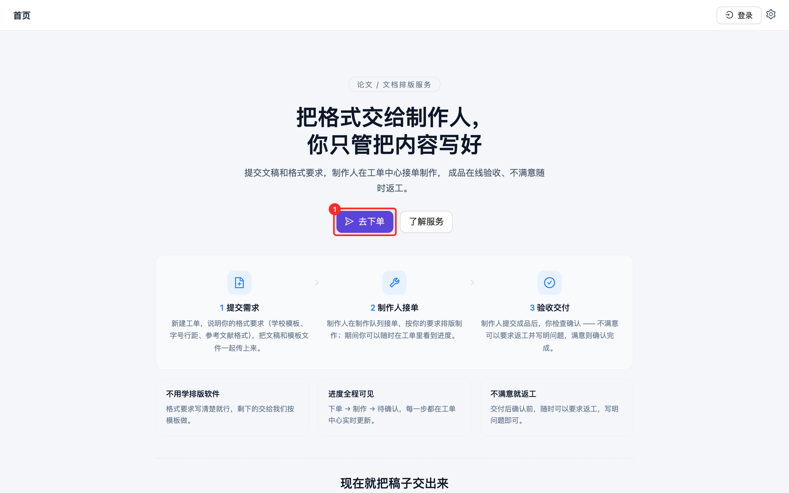
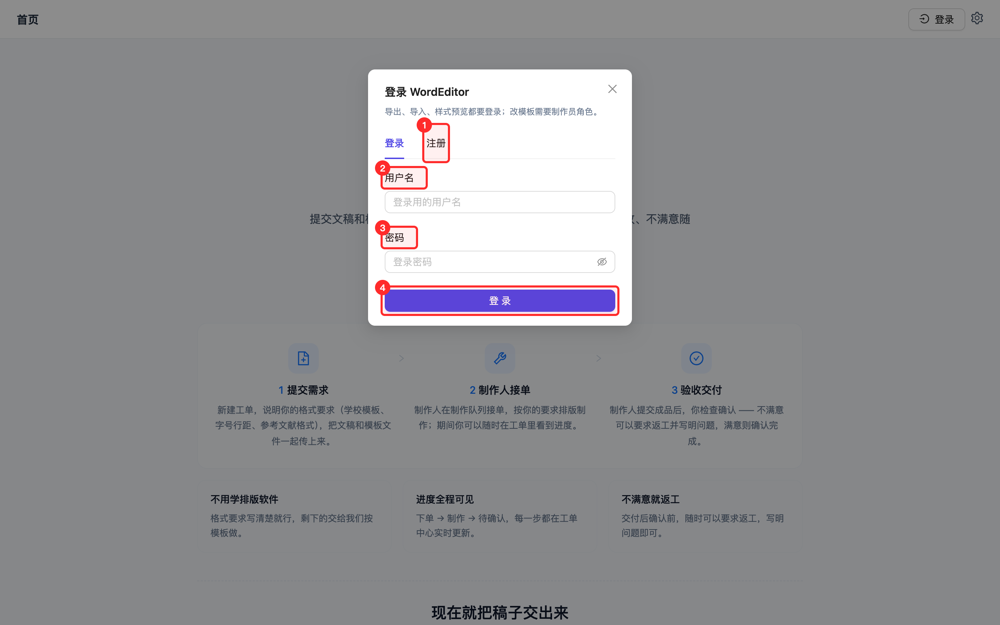
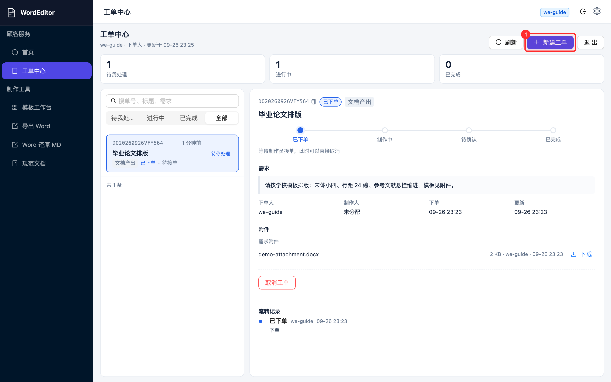
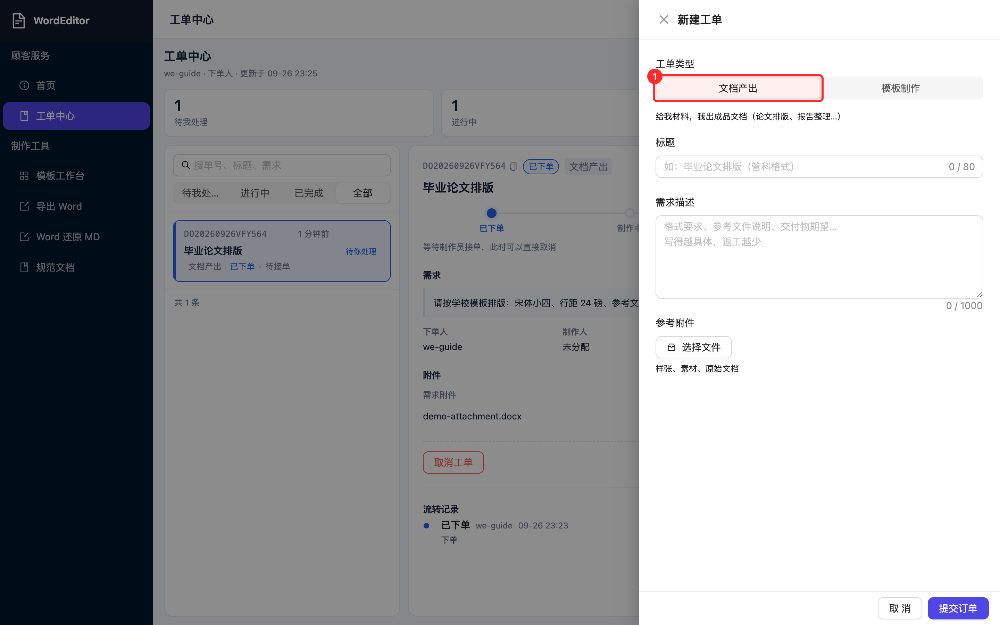
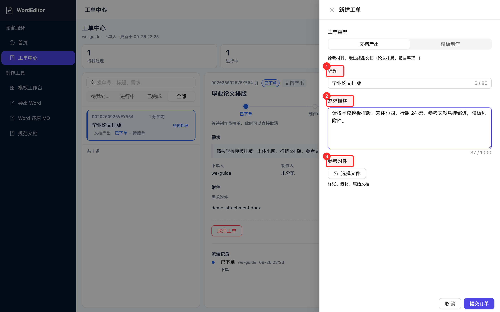
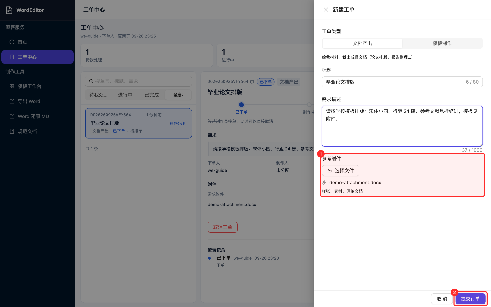
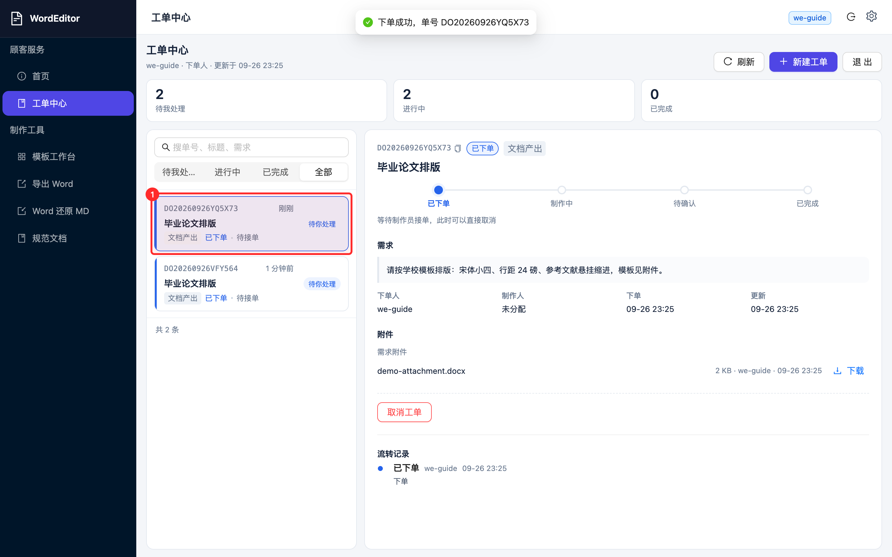
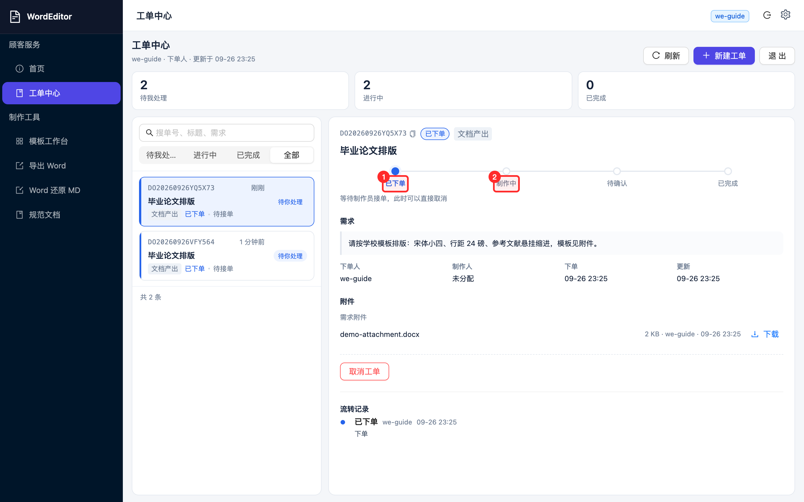
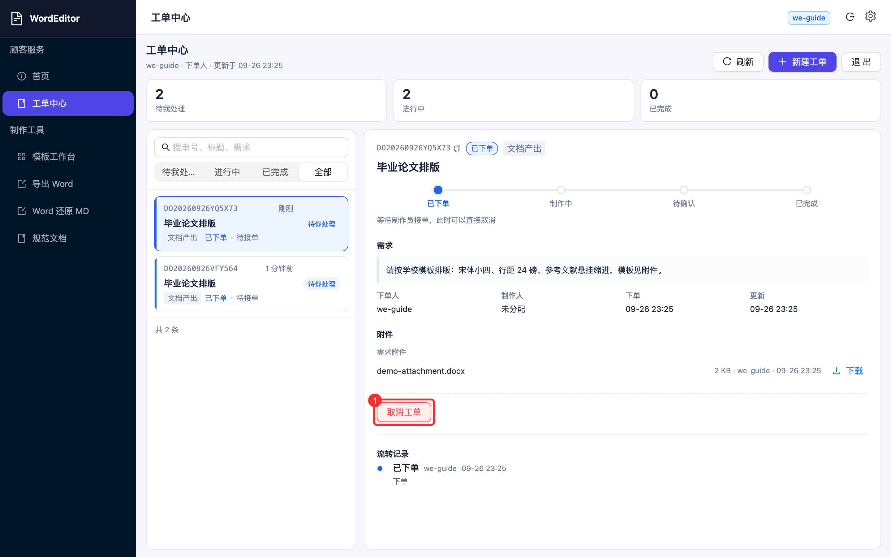

# 第1章 服务简介与下单流程

## 这是什么服务

WordEditor 是一个论文与文档排版服务：你把文稿和格式要求交上来，制作人员按你的要求排版制作，成品在工单中心在线验收。你不需要学习任何排版软件，只需要把要求写清楚。

服务入口：`https://word.roginx.ink`（暂定域名，如有变化以实际通知为准）。

## 下单全流程

整个服务围绕「工单」运转，一共三步：

1. **提交需求**：注册登录后，在工单中心新建工单，写清格式要求，把文稿和模板文件一起传上去。
2. **制作人接单**：制作人在制作队列接单，按你的要求制作；期间你可以随时在工单中心看到进度。
3. **验收交付**：制作人提交成品后，你检查确认。不满意可以在确认前要求返工并写明问题；确认完成后工单关闭，服务端会清理该单的临时文件。

## 下单前要准备什么

- **文稿文件**：Word、Markdown 或纯文本均可。
- **格式要求**：学校模板文件（如有）请一并上传；没有模板文件的，用文字写清字号、行距、页边距、参考文献格式等要求。
- 要求写得越具体，返工越少。
# 第2章 注册与登录

## 注册账号

打开服务首页，点击右上角**登录**按钮，在弹出窗口中切换到「注册」标签页，填写用户名和密码（至少 6 位）后提交。注册成功后回到「登录」标签页登录即可。

## 登录

在登录窗口输入用户名与密码，点击**登录**。登录成功后，右上角会显示你的用户名，页面数据自动加载，无需刷新。

登录状态在浏览器中保持；换设备或清理浏览器数据后需要重新登录。

## 常见登录问题

- **提示密码错误**：确认用户名拼写；密码至少 6 位。
- **页面提示「登录后才能读取模板」**：点击提示中的「登录」按钮即可。
# 第3章 新建工单

**入口**：登录后点击左侧「工单中心」，再点击右上角**新建工单**。

## 选择工单类型

新建工单第一步是选类型，二选一：

- **文档产出**：给我材料，我出成品文档。论文排版、报告整理等绝大多数需求选这个。
- **模板制作**：给我一份样张，我做一套可复用的模板。适合需要反复套用同一格式的场景。

## 填写标题与需求描述

- **标题**（必填）：一句话说清要做什么，如「毕业论文排版（管科格式）」。
- **需求描述**：格式要求、参考文件说明、交付物期望。写得越具体，返工越少。建议写清：字号、行距、页边距、标题编号规则、参考文献格式、页眉页脚要求等。
- **参考附件**（③）：上传学校模板、样张、原始文稿。支持多个文件。

## 上传附件与提交

点击**选择文件**挑选本地文件，可一次选多个；文件上传显示进度。确认无误后点击**提交订单**。

提交成功后页面会显示工单号（`DO` 开头），列表中立刻能看到这张单，状态为「已下单」。

## 要求与限制

- 单个附件不超过 50MB。
- 附件会在工单终结（确认完成或取消）后被服务端清理，**需要留档的文件请自行备份**。
# 第4章 跟踪工单进度

## 工单状态一览

工单一共六种状态，按流转顺序为：

| 状态 | 含义 | 此时谁在动手 |
|---|---|---|
| 已下单 | 工单已提交，等待制作人接单 | 等制作人 |
| 制作中 | 制作人已接单，正在制作 | 制作人 |
| 待确认 | 制作人已提交成品，等你检查 | 你 |
| 返工中 | 你要求了返工，制作人按说明重做 | 制作人 |
| 已完成 | 你确认验收，工单关闭 | — |
| 已取消 | 你在接单前取消了工单 | — |

## 在列表里看进度

工单中心的列表按「我的工单」展示你下的所有单，每张卡片显示单号、标题、当前状态和最后更新时间。顶部统计条（待我处理 / 进行中 / 已完成）点击即筛选。

## 在详情里看完整记录

点击任意一张卡片，右侧显示详情：四站状态轨（已下单 → 制作中 → 待确认 → 已完成）标出当前走到哪一步，下方是需求、附件分组和完整的流转记录（每一步谁做的、什么时候、带了什么说明）。

- 状态为「已下单」时，你随时可以**取消工单**（见下图）；
- 单号可点击复制，沟通时引用单号最方便。
- 列表每 20 秒自动刷新，无需手动刷新页面。

# 第5章 验收：确认完成与要求返工

制作人提交成品后，工单进入「**待确认**」。这一步由你把关，两种结果：

## 满意：确认完成

在详情页点击**确认完成**。系统会提示：确认后工单关闭，无法再要求返工，且服务端会清理该单的临时附件。确认前请把成品检查好、需要留档的文件提前下载。

## 不满意：要求返工

在详情页点击**要求返工**，在弹窗中**必填**返工说明，写清哪里不符合要求；也可以从快捷短语（目录页码、参考文献缩进、封面信息、标题层级）中选一条快速填入。提交后工单进入「返工中」，制作人会按你的说明重新制作。

返工可以多次进行，直到你满意为止；但**一旦确认完成就不能再返工**。

## 验收检查清单

建议按这张清单检查成品：

| 检查项 | 要点 |
|---|---|
| 封面 | 标题、姓名、学号、导师等信息与要求一致 |
| 目录 | 页码与正文一致，层级正确 |
| 正文格式 | 字号、行距、缩进符合要求 |
| 图表 | 编号连续、标题位置正确 |
| 参考文献 | 格式与要求一致（如悬挂缩进） |
| 页眉页脚 | 页码格式、奇偶页要求 |

## 交付文件说明

- 待确认状态下，交付附件在详情页「交付附件」分组中，点击文件名即可下载。
- 工单确认完成后，服务端会清空该单的临时文件，附件条目会显示「已清理」标记——**验收时请第一时间下载成品**。
# 第6章 常见问题

**Q：附件上传失败提示「文件名含非法字符」？**
旧版本限制已移除。现在只拦截空文件名、控制字符和超长文件名（120 字符以内均支持），带空格、括号、加号的正常文件名可以直接上传。如仍遇到问题，尝试把文件名缩短后重试。

**Q：工单提交后很久没人接单？**
工单会一直保持在「已下单」状态等待制作人。如急用，可先取消后重新下单并在需求描述中注明截止时间；也可以直接联系管理员。

**Q：不小心取消或下错了单？**
直接重新下一张正确的单即可。已取消的单仍可在「已完成」筛选里查看记录，附件已被清理。

**Q：确认完成后还能再改吗？**
不能。确认完成后工单关闭、临时文件已清理。如确需修改，请新建工单并注明「返修 + 原单号」。

**Q：制作的成品文件从哪里下载？**
工单进入「待确认」后，在详情页「交付附件」分组下载。确认完成后文件会被服务端清理，请务必在验收时下载留档。

**Q：我的文稿和模板文件安全吗？**
工单附件仅下单人与制作该单的制作人员可见；工单终结后服务端自动清理全部临时文件。
